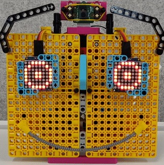
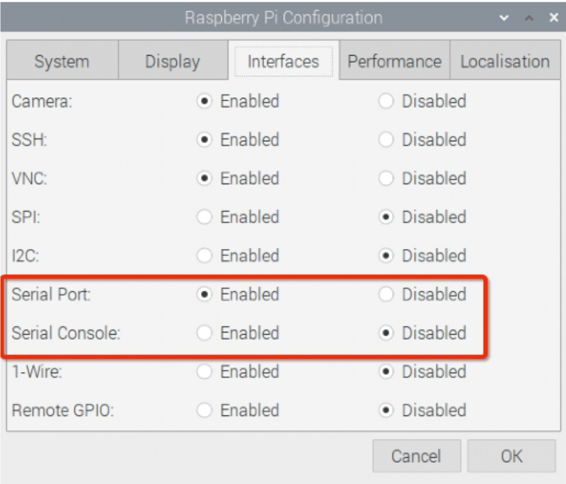

## Einleitung

[[[camera-bullseye]]]

Im Laufe dieses Projekts konstruieren Sie ein Robotergesicht aus einer Kombination von LEGO® und elektronischen Komponenten. Anschließend verwenden Sie ein vorhandenes Modell für maschinelles Lernen, um Ihrem Gesicht zu helfen, verschiedene Objekte zu erkennen und darauf zu reagieren.

### Was du machen wirst

--- no-print ---

Dein Robotergesicht wird eine Reihe von Objekten erkennen und darauf reagieren können. Hier siehst du unser Beispiel eines Robotergesichts.


Du kannst dein Robotergesicht aus allen verfügbaren LEGO® Bausteinen und anderen Materialien bauen. Wir haben das [LEGO® SPIKE™ Prime-Set](https://education.lego.com/en-gb/product/spike-prime) verwendet.

--- /no-print ---

--- print-only ---



--- /print-only ---

--- collapse ---
---
title: Was du brauchen wirst
---
### Hardware

+ Einen Raspberry Pi-Computer
+ Ein Raspberry Pi Build HAT
+ Ein Raspberry Pi Kameramodul
+ Ein 30cm Raspberry Pi Kamera Flachbandkabel
+ 2× kleine LEGO® Technic™ Motoren
+ 1× großer LEGO® Technic™ Motor
+ 1× Mini-Steckbrett
+ 12× Stecker-zu-Buchse Überbrückungsdrähte (20cm)
+ 2× [Adafruit 8×8 LED-Matrizen](https://www.adafruit.com/product/1049) (oder ähnlich – erfordert etwas Löten zum Zusammenbauen und Modifizieren)
+ Extra lange Stacking-Header-Pins
+ Sortiment von LEGO® Teilen (wir haben eine Auswahl aus dem [LEGO® SPIKE™ Prime Kit](https://education.lego.com/en-gb/product/spike-prime) verwendet)
+ 20mm Stecker-Buchse-Verlängerung
+ Lötwerkzeug

### Software

Öffne ein Terminal und verwende die folgenden Befehle, um die benötigten Bibliotheken zu installieren:

+ BuildHAT Python-Bibliothek zur Steuerung des Build HAT

```
sudo pip3 install buildhat
```

+ TensorFlow Lite-Bibliothek und Mustermodell und Etiketten

```
echo "deb https://packages.cloud.google.com/apt coral-edgetpu-stable main" | sudo tee /etc/apt/sources.list.d/coral-edgetpu.list
curl https://packages.cloud.google.com/apt/doc/apt-key.gpg | sudo apt-key add -
sudo apt-get update
sudo apt-get install python3-tflite-runtime
```

+ Adafruit LED-Matrix-Bibliothek

```
pip3 install adafruit-circuitpython-ht16k33
```

### Downloads

+ [Bildklassifizierer-Testdateien](https://rpf.io/p/en/lego-robot-face-go){:target="_blank"}

--- /collapse ---

--- collapse ---
---
title: Was du lernen wirst
---

+ Komplexere Mechanismen mit LEGO® . bauen
+ Eine Machine Learning-Bibliothek zum Erkennen von Bildern zu verwenden
+ dictionary-Strukturen zur Steuerung von Gesichtsausdrücken zu verwenden

--- /collapse ---

--- collapse ---
---
title: Zusätzliche Informationen für Pädagogen
---

Wenn Sie dieses Projekt ausdrucken möchten, verwenden Sie bitte die [druckerfreundliche Version](https://projects.raspberrypi.org/en/projects/robot-face/print){:target="_blank"}.

[Hier ist ein Link zu den Ressourcen für dieses Projekt](https://rpf.io/p/en/lego-robot-face-go){:target="_blank"}.

--- /collapse ---

Bevor du beginnst, musst du deinen Raspberry Pi-Computer eingerichtet und deinen Build HAT aufgesteckt haben:

--- task ---

Montiere deinen Raspberry Pi mit M2-Schrauben und Muttern auf der LEGO Build Plate und stelle sicher, dass sich der Raspberry Pi auf der Seite ohne die "Kante" befindet:

 

--- /task ---

Die Montage des Raspberry Pi auf diese Weise ermöglicht einen einfachen Zugriff auf die Anschlüsse und den SD-Kartensteckplatz. Mit der Bauplatte kannst du den Raspberry Pi einfacher mit der Hauptstruktur deines Dashboards verbinden.

--- task ---

Richte den Build HAT mit dem Raspberry Pi aus und achte darauf das Etikett `This way up` zu sehen. Stelle sicher, dass alle GPIO-Pins vom Stecker des HAT bedeckt sind, und drücke ihn fest nach unten. (Das Beispiel verwendet einen [Stacking-Header](https://www.adafruit.com/product/2223){:target="_blank"}, der die Pins verlängert.)

 

--- /task ---

Jetzt solltest du deinen Raspberry Pi über die 7,5-V-Hohlstecker-Buchse des Build HAT mit Strom versorgen, damit du die Motoren verwenden kannst.

--- task ---

Wenn du dies noch nicht getan hast, richte deinen Raspberry Pi ein, indem du diesen Anweisungen folgst:

[Einrichten deines Raspberry Pi](https://projects.raspberrypi.org/en/projects/raspberry-pi-setting-up){:target="_blank"}

--- /task ---

--- task ---

Nachdem der Raspberry Pi gebootet hat, öffne das Raspberry Pi Configuration Tool, indem du auf die Schaltfläche Raspberry Menu (Himbeere) klickst und dann „Einstellungen“ und dann „Raspberry Pi Konfiguration“ auswählst.

Klicke auf die Registerkarte "Schnittstellen" und passe die seriellen Einstellungen wie unten gezeigt an:



--- /task ---

--- task --- Du musst auch die buildhat Python-Bibliothek installieren, indem du diese Anweisungen befolgst:

--- collapse ---
---
title: Installation der buildhat Python-Bibliothek
---

Öffne ein Terminalfenster auf deinem Raspberry Pi, indem du <kbd>Strg</kbd>+<kbd>Alt</kbd>+<kbd>T</kbd>drückst.

Gib an der Eingabeaufforderung `sudo pip3 install buildhat` ein

Drücke <kbd>Enter</kbd> und warte auf die Meldung "Installation abgeschlossen".

--- /collapse ---

--- /task ---
