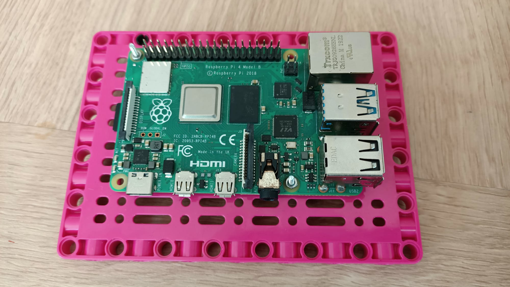

## Einleitung

Im Laufe dieses Projekts konstruieren Sie ein Robotergesicht aus einer Kombination von LEGO® und elektronischen Komponenten. Anschließend verwenden Sie ein vorhandenes Modell für maschinelles Lernen, um Ihrem Gesicht zu helfen, verschiedene Objekte zu erkennen und darauf zu reagieren.

### Was du machen wirst

--- no-print ---

Ihr Robotergesicht kann eine Reihe von Objekten erkennen und darauf reagieren. Hier sehen Sie unser Beispiel eines Robotergesichts.


Sie sollten Ihr Robotergesicht aus allen verfügbaren LEGO® und anderen Materialien bauen. Wir haben das [LEGO® SPIKE™ Prime-Kit](https://education.lego.com/en-gb/product/spike-prime).

--- /no-print ---

--- print-only ---


--- /print-only ---

--- collapse ---
---
title: Was du brauchen wirst
---
### Hardware

+ Ein Raspberry Pi-Computer
+ Ein Raspberry Pi Build HAT
+ Ein Raspberry Pi Kameramodul
+ Ein 30cm Raspberry Pi Kamera Flachbandkabel
+ 2× kleine LEGO® Technic™ Motoren
+ 1× großer LEGO® Technic™ Motor
+ 1× Mini-Steckbrett
+ 12× Stecker-zu-Buchse Überbrückungsdrähte (20cm)
+ 2× [Adafruit 8×8 LED-Matrizen](https://www.adafruit.com/product/1049) (oder ähnlich – erfordert etwas Löten zum Zusammenbauen und Modifizieren)
+ Extra lange Stacking-Header-Pins
+ Sortiment von LEGO® (wir haben eine Auswahl aus dem [LEGO® SPIKE™ Prime Kit](https://education.lego.com/en-gb/product/spike-prime))
+ 20mm FM-Header-Extender.
+ Lötkit

### Software

Öffnen Sie ein Terminal und verwenden Sie die folgenden Befehle, um die benötigten Bibliotheken zu installieren:

+ BuildHAT Python-Bibliothek zur Steuerung des Build HAT

```
sudo pip3 installiere Buildhat
```

+ TensorFlow Lite-Bibliothek und Mustermodell und Etiketten

```
echo "deb https://packages.cloud.google.com/apt coral-edgetpu-stable main" | sudo tee /etc/apt/sources.list.d/coral-edgetpu.list
curl https://packages.cloud.google.com/apt/doc/apt-key.gpg | sudo apt-key add -
sudo apt-get update
sudo apt-get install python3-tflite-runtime
```

+ Adafruit LED-Matrix-Bibliothek

```
pip3 install adafruit-circuitpython-ht16k33
```

### Downloads

+ [Bildklassifizierer-Testdateien](http://rpf.io/p/en/lego-robot-face-go){:target="_blank"}

--- /collapse ---

--- collapse ---
---
title: Was du lernen wirst
---

+ Komplexere Mechanismen mit LEGO® . bauen
+ So verwenden Sie eine Machine Learning-Bibliothek zum Erkennen von Bildern
+ So verwenden Sie Wörterbuchdatenstrukturen zur Steuerung von Gesichtsausdrücken

--- /collapse ---

--- collapse ---
---
title: Zusätzliche Informationen für Pädagogen
---

Wenn du dieses Projekt ausdrucken möchtest, verwende die [druckerfreundliche Version](https://projects.raspberrypi.org/en/projects/robot-face/print){:target="_blank"}.

[Hier ist ein Link zu den Ressourcen für dieses Projekt](http://rpf.io/p/en/robot-face-go){:target="_blank"}.

--- /collapse ---

Bevor Sie beginnen, müssen Sie Ihren Raspberry Pi-Computer eingerichtet und Ihren Build HAT angeschlossen haben:

--- task ---

Montieren Sie Ihren Raspberry Pi mit M2-Schrauben und Muttern auf der LEGO Build Plate und stellen Sie sicher, dass sich der Raspberry Pi auf der Seite ohne die "Kante" befindet:

 

--- /task ---

Die Montage des Raspberry Pi auf diese Weise ermöglicht einen einfachen Zugriff auf die Anschlüsse sowie den SD-Kartensteckplatz. Mit der Bauplatte können Sie den Raspberry Pi einfacher mit der Hauptstruktur Ihres Dashboards verbinden.

--- task ---

Richten Sie den Build HAT mit dem Raspberry Pi aus und stellen Sie sicher, dass Sie das Label `This way up` Stellen Sie sicher, dass alle GPIO-Pins vom HAT bedeckt sind, und drücken Sie sie fest nach unten. (Das Beispiel verwendet einen [Stacking-Header](https://www.adafruit.com/product/2223){:target="_blank"}, wodurch die Pins länger werden.)

 

--- /task ---

Sie sollten jetzt Ihren Raspberry Pi über die 7,5-V-Barrel-Buchse des Build HAT mit Strom versorgen, damit Sie die Motoren verwenden können.

--- task ---

Wenn Sie dies noch nicht getan haben, richten Sie Ihren Raspberry Pi ein, indem Sie diesen Anweisungen folgen:

[Einrichten Ihres Raspberry Pi](https://projects.raspberrypi.org/en/projects/raspberry-pi-setting-up){:target="_blank"}

--- /task ---

--- task ---

Nachdem der Raspberry Pi gebootet ist, öffnen Sie das Raspberry Pi Configuration Tool, indem Sie auf die Schaltfläche Raspberry Menu klicken und dann „Preferences“ und dann „Raspberry Pi Configuration“ auswählen.

Klicken Sie auf die Registerkarte "Schnittstellen" und passen Sie die seriellen Einstellungen wie unten gezeigt an:


--- /task ---

--- task --- Sie müssen auch die Buildhat-Python-Bibliothek installieren, indem Sie diesen Anweisungen folgen:

--- collapse ---
---
Titel: Installieren Sie die Buildhat-Python-Bibliothek
---

Öffnen Sie ein Terminalfenster auf Ihrem Raspberry Pi, indem Sie <kbd>Strg</kbd>+<kbd>Alt</kbd>+<kbd>T</kbd>drücken.

Geben Sie an der Eingabeaufforderung `sudo pip3 install buildhat`

Drücken Sie <kbd>Geben Sie</kbd> und warten Sie auf die Meldung "Installation abgeschlossen".

--- /collapse ---

--- /task ---