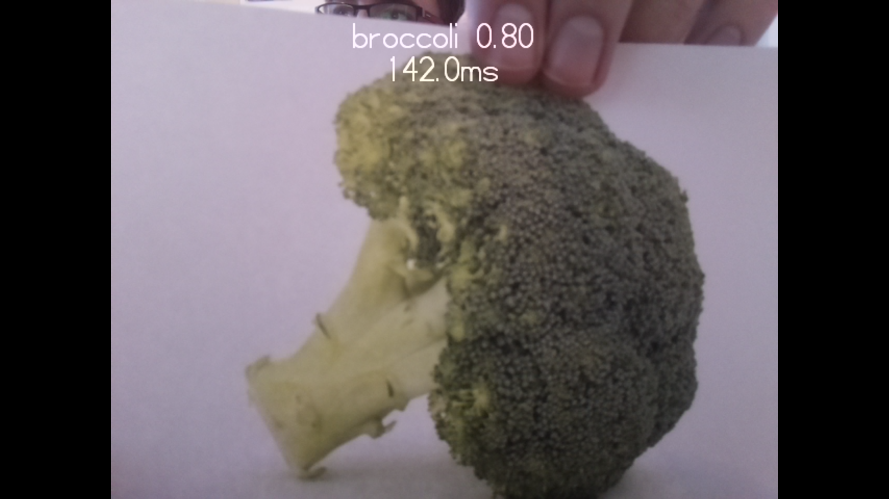

## Teste das Modell für maschinelles Lernen

Dein erster Schritt besteht darin, zu verstehen und zu testen, wie du ein Modell für maschinelles Lernen verwenden kannst, um Objekte zu erkennen. Für dieses Projekt erstellst und trainierst du kein eigenes Modell, sondern verwendest ein Beispielmodell, das eine Reihe von Objekten erkennen kann.

Bevor du beginnst, musst du deinen Raspberry Pi-Computer eingerichtet und eine Raspberry Pi Kamera angeschlossen haben. In den folgenden Anleitungen findest du Anweisungen, wie du beides tun kannst:

--- task --- Verbinde ein Raspberry Pi-Kameramodul mit deinem Raspberry Pi, indem du diesen Anweisungen folgst:

[Erste Schritte mit dem Kameramodul](https://projects.raspberrypi.org/en/projects/getting-started-with-picamera){:target="_blank"}

--- /task ---

Computer haben keine natürliche Lernfähigkeit. Die meisten Dinge, die Computer tun, wurden direkt von einem Menschen programmiert. Dadurch eignen sie sich hervorragend für Aufgaben, die ein paar klar definierte Regeln haben, aber sie kämpfen mit menschlicheren Aufgaben wie dem Erkennen verschiedener Objekte.

Durch maschinelles Lernen können einem Computer Tausende und Abertausende von Bildern angezeigt werden, von denen jedes benannt ist. Nach und nach kann das Programm die Eigenschaften einer Gruppe von Bildern lernen und dir dann die richtige Bezeichnung nennen.

Das Endergebnis dieses Prozesses wird als Modell bezeichnet. Nach dem Training können Modelle in der realen Welt verwendet werden, um Aufgaben auszuführen. 

### Testen eines Modells

--- task ---

 Lade zunächst die Ressourcen für dieses Projekt auf deinen Raspberry Pi [herunter, indem du hier](http://rpf.io/p/en/robot-face-go){:target="_blank"} klickst.

 --- /task ---

 --- task ---

 Entpacke die Dateien und verschiebe dann das entpackte Verzeichnis in dein `/home/pi` Verzeichnis.

 --- /task ---

 Du wirst eine Reihe von Dateien finden, die für das Projekt nützlich sind. Für diesen Schritt verwende aber:

 - `model.tflite` – Die Modelldatei für maschinelles Lernen
 - `labels.txt` - Bezeichnungen für jedes Objekt, das das Modell erkennen kann
 - `classifer.py` – Ein Python-Programm zum Testen des Modells

--- task ---

Öffne **Thonny**, das sich im Menü **Entwicklung** im **Startmenü** deines Raspberry Pi befindet.

 --- /task ---

--- task ---

Öffne und **führe** das `classifier.py` Programm aus.

Dein Raspberry Pi zeigt Folgendes an:
+ Was die Kamera "sieht"
+ Den Name des Hauptobjekts, das es erkennt

 

--- /task ---

--- task ---

 **Versuche** der Kamera verschiedene Objekte zu präsentieren und untersuchee, welche sie sicher erkennt.

 Experimentiere dabei mit:
   - **Hintergrund**: Die Kamera erkennt möglicherweise Hintergrund-Objekte anstelle des Objekts, das du vor die Kamera hältst.
   - **Objektposition**: Wo und wie du das Objekt hältst, kann sich auf seine Erkennung auswirken. Experimentiere mit der Entfernung von der Kamera und drehe das Objekt in verschiedene Richtungen.
   - **Beleuchtung**: Die Beleuchtung in deinem Raum kann beeinflussen, wie gut ein Objekt erkannt wird. Versuche, mehr Lichter einzuschalten oder einige Lichter auszuschalten.
   - **Bilder**: Es kann hilfreich sein, der Kamera ausgedruckte Bilder von Objekten statt der Objekte selbst zu zeigen.

--- /task ---

--- task ---

Finde **mindestens** vier Objekte (oder Bilder), die deine Kamera zuverlässig erkennen kann – du benötigst sie für dein Modell für maschinelles Lernen.

--- /task ---

--- save ---
