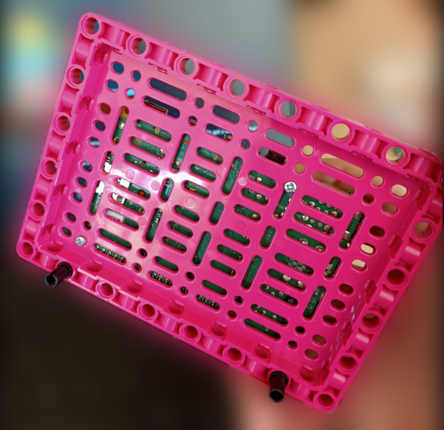
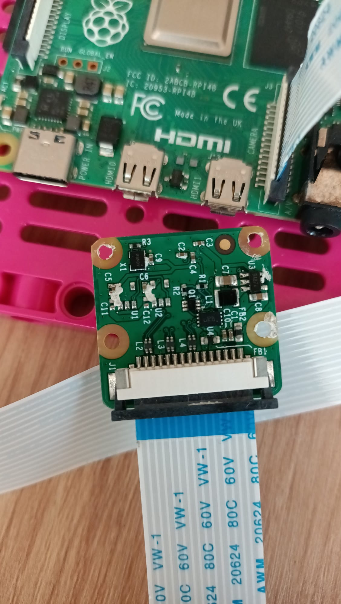
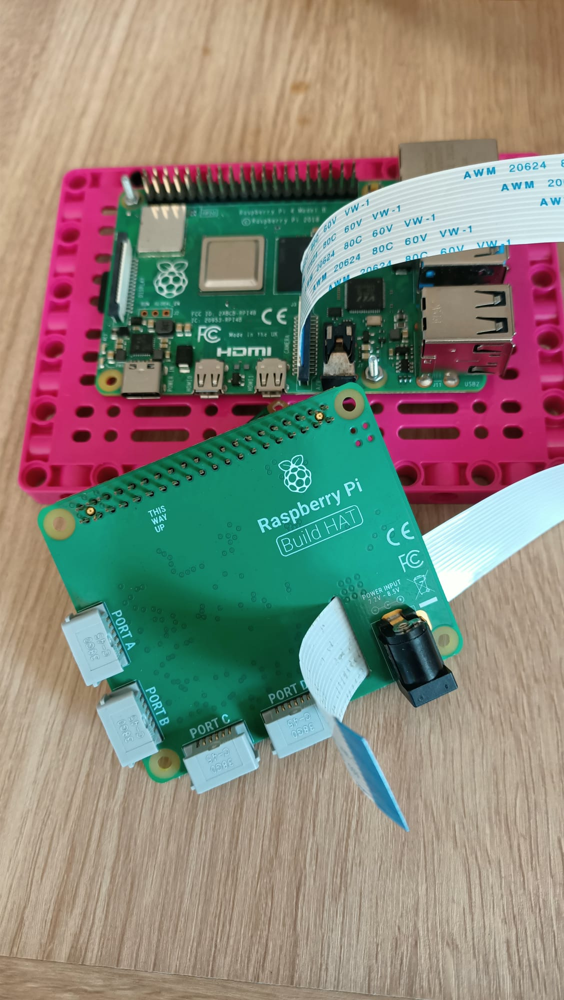
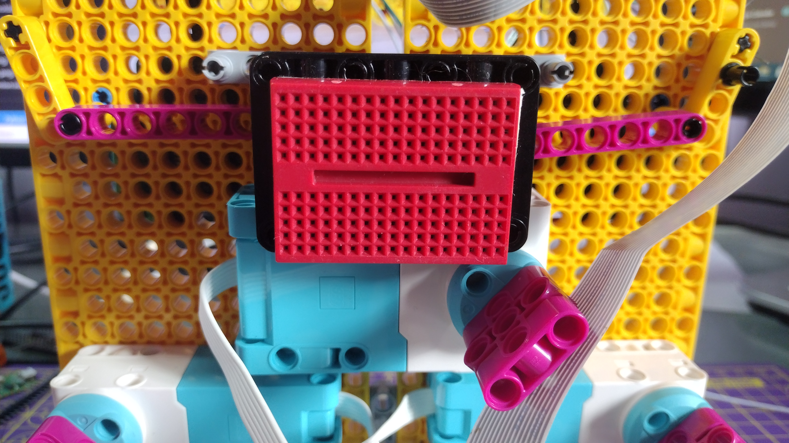
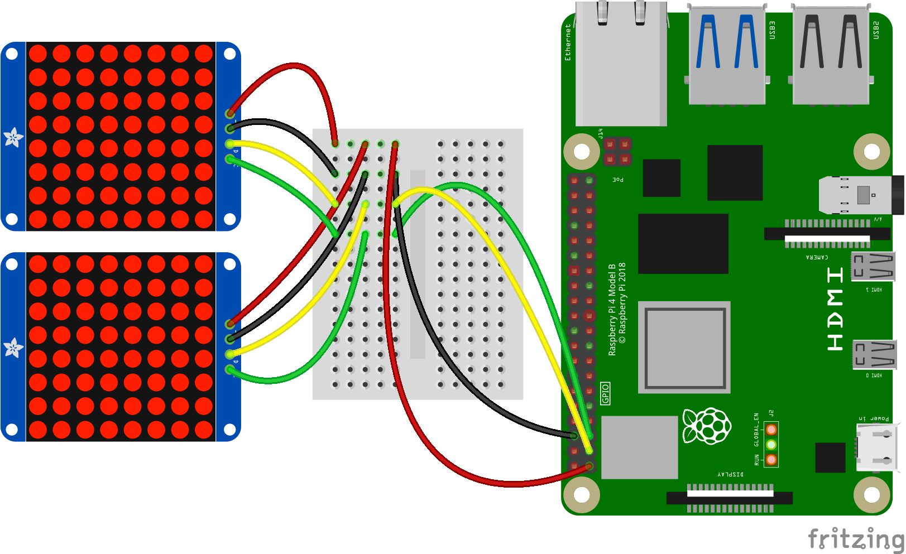

## Füge den Raspberry Pi hinzu

Für dieses Projekt solltest du idealerweise das Build Plate-Element verwenden, um deinen Raspberry Pi und das Build HAT zu montieren:

--- task ---

Montiere deinen Raspberry Pi mit M2-Schrauben und Muttern auf der Bauplatte und stelle sicher, dass sich der Pi auf der flachen Seite befindet:

 

--- /task ---

Die Montage des Raspberry Pi auf diese Weise ermöglicht einen einfachen Zugriff auf die Anschlüsse und den SD-Kartensteckplatz.

### Montiere die Kamera und den Build HAT

Bevor du den Build HAT hinzufügst, musst du zuerst das Flachbandkabel der Kamera am Raspberry Pi befestigen und durch das Loch im Build HAT fädeln. Wenn du die Kameraplatine noch nicht mit deinem Raspberry Pi verbunden hast, kannst du dies wie folgt tun: [Erste Schritte mit dem Kameramodul](https://projects.raspberrypi.org/de-DE/projects/getting-started-with-picamera){:target="_blank"}.

--- task ---

Lass das Kameraflachkabel mit dem Raspberry Pi verbunden, aber entferne die Kameraplatine vom anderen Ende des Bandkabels, indem du den kleinen schwarzen Clip nach oben drückst und das Band herausziehst:

--- /task ---

--- task ---

Stecken Sie das Band von der Unterseite des Build HAT durch, dass es durch die Oberseite herauskommt. Achte darauf, dass das Band nicht verdreht ist: 

--- /task ---

--- task ---

Richte den Build HAT mit dem Raspberry Pi aus und stelle sicher, dass du das Etikett `This way up` siehst. Achte darauf, dass alle GPIO-Pins vom Stecker des HAT bedeckt sind, und drücke ihn fest nach unten. (Das Beispiel verwendet einen [Stacking-Header](https://www.adafruit.com/product/2223){:target="_blank"}, wodurch die Pins länger werden.)

--- /task ---

--- task ---
Bring die Kamera wieder am Ende des Flachbandkabels an und stellen Sie sicher, dass es nicht verdreht ist.

--- /task ---

--- task ---
Montiere die Bauplatte mit einigen schwarzen Bolzen an der Rückseite deines Robotergesichts. 

Die Montage des Raspberry Pi auf diese Weise bietet den besten Zugang zu Steckern und Pins. Das bewirkt, dass deine Hohlstecker-Buchse einfach erreichbar ist, um darüber das Robotergesicht mit Strom zu versorgen.

--- /task ---

--- task ---

Schließe deine kleinen LEGO® Technic™ Motoren an die Anschlüsse A und B an, um den Mund zu steuern.

--- /task ---

--- task ---

Schließe deinen großen LEGO® Technic™ Motor an Port C an, um die Augenbrauen zu bewegen.

--- /task ---

--- task ---

Klebe das Steckbrett mit dem Doppelklebeband an der Unterseite oben auf den Rahmen, der den großen LEGO® Motor trägt.

--- /task ---

--- task ---

Montiere die Kameraplatine im Halter auf der Oberseite des Roboters, indem du das Band unter den Halter führst und die Kamera zwischen den Gummistoppern auf beiden Seiten verkeilst.

Sichere die Kamera mit einem Gummiband mit den schwarzen Ösen auf beiden Seiten.

--- /task ---

Um das Augenpaar am Raspberry Pi GPIO anzuschließen, musst du es zuerst mit einem Steckbrett und von dort mit den GPIO-Pins verbinden.

--- task ---

Verwende acht Stecker-Buchse-Überbrückungsdrähte, um die vier Stifte von jedem Auge auf dem Steckbrett miteinander zu verbinden. Stelle sicher, dass sich beide VCC-Pins in derselben Reihe des Steckbretts befinden und sich beide GND-Pins in derselben Reihe befinden, und so weiter. Verbinden Sie dann die 3V3-, GND-, SDA- und SCL-Pins des Raspberry Pi, wie unten gezeigt.

--- /task ---

Dein Robotergesicht ist jetzt gebaut und verbunden und kann programmiert werden!

