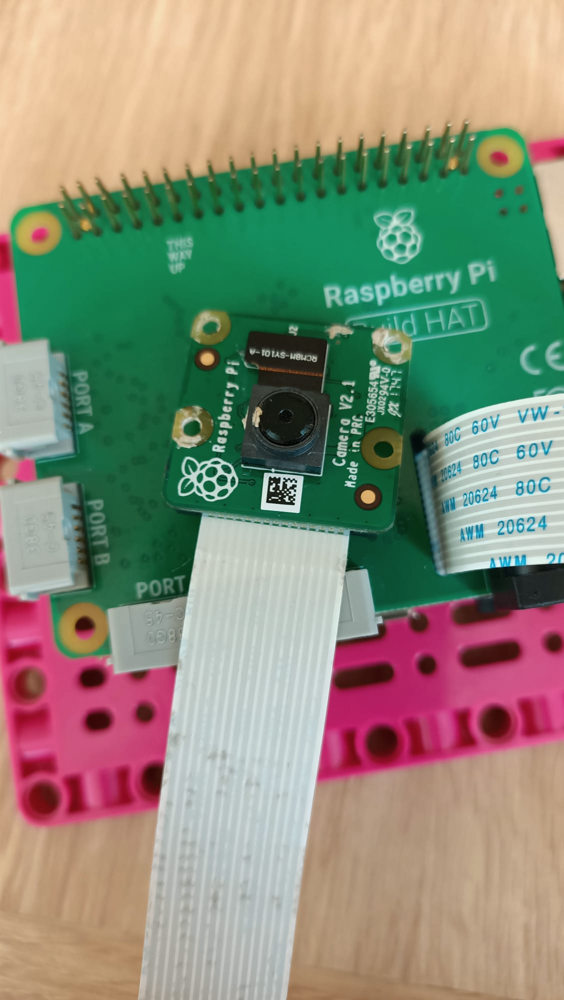

## Fügen Sie den Himbeer-Pi . hinzu

Für dieses Projekt möchten Sie idealerweise das Build Plate-Element verwenden, um Ihren Raspberry Pi und Build HAT zu montieren:

--- task ---

Montieren Sie Ihren Raspberry Pi mit M2-Schrauben und Muttern auf der Bauplatte und stellen Sie sicher, dass sich der Pi auf der flachen Seite befindet:

 

--- /task ---

Die Montage des Raspberry Pi auf diese Weise ermöglicht einen einfachen Zugriff auf die Anschlüsse sowie den SD-Kartensteckplatz.

### Montieren Sie die Kamera und bauen Sie HAT

Bevor Sie den Build HAT hinzufügen, müssen Sie zuerst das Flachbandkabel der Kamera am Raspberry Pi befestigen und durch das Loch im Build HAT fädeln. Wenn Sie die Kameraplatine noch nicht mit Ihrem Raspberry Pi verbunden haben, können Sie dies wie folgt tun: [Erste Schritte mit dem Kameramodul](https://projects.raspberrypi.org/en/projects/getting-started-with-picamera){:target="_blank"}.

--- task ---

Lassen Sie das Kameraband mit dem Raspberry Pi verbunden, aber entfernen Sie die Kameraplatine vom losen Ende des Bandes, indem Sie den kleinen schwarzen Clip nach oben drücken und das Band herausziehen:

--- /task ---

--- task ---

Stecken Sie das Band durch die Unterseite des Build HAT und durch die Oberseite, um sicherzustellen, dass das Band nicht verdreht ist: 

--- /task ---

--- task ---

Richten Sie den Build HAT mit dem Raspberry Pi aus und stellen Sie sicher, dass Sie das Label `This way up` Stellen Sie sicher, dass alle GPIO-Pins vom HAT bedeckt sind, und drücken Sie sie fest nach unten. (Das Beispiel verwendet einen [Stacking-Header](https://www.adafruit.com/product/2223){:target="_blank"}, wodurch die Pins länger werden.)

--- /task ---

--- Aufgabe --- Bringen Sie die Kamera wieder am Ende des Flachbandkabels an und stellen Sie sicher, dass es nicht verdreht ist.

--- /task ---

--- Aufgabe --- Verbinden Sie die Bauplatte mit einigen schwarzen Bolzen an der Rückseite Ihres Robotergesichts. 

Die Montage des Raspberry Pi auf diese Weise bietet den besten Zugang zu Anschlüssen und Pins und bedeutet, dass Ihre Barrel-Buchse einfach angeschlossen werden kann, um das Robotergesicht mit Strom zu versorgen.

--- /task ---

--- task ---

Schließen Sie Ihre kleinen LEGO® Technic™ Motoren an die Anschlüsse A und B an, um den Mund zu steuern.

--- /task ---

--- task ---

Schließen Sie Ihren großen LEGO® Technic™ Motor an Port C an, um die Augenbrauen zu kontrollieren.

--- /task ---

--- task ---

Kleben Sie mit dem Klebepad an der Unterseite ein Steckbrett oben auf den Rahmen, der den großen LEGO® Motor trägt.

--- /task ---

--- task ---

Montieren Sie die Kameraplatine im Halter auf der Oberseite des Roboters, indem Sie das Band unter den Halter führen und die Kamera zwischen den Gummistoppern auf beiden Seiten verkeilen.

Sichern Sie die Kamera mit einem Gummiband mit den schwarzen Ösen auf beiden Seiten.

--- /task ---

Um das Augenpaar mit dem Raspberry Pi GPIO zu verbinden, müssen sie zuerst mit einem Steckbrett und dann mit den GPIO-Pins vom Steckbrett verbunden werden.

--- task ---

Verwenden Sie acht männlich-weibliche Überbrückungsdrähte, um die vier Stifte von jedem Auge auf dem Steckbrett miteinander zu verbinden. Stellen Sie sicher, dass sich beide VCC-Pins in derselben Reihe des Steckbretts befinden, sich beide GND-Pins in derselben Reihe befinden und so weiter. Verbinden Sie dann die 3V3-, GND-, SDA- und SCL-Pins des Raspberry Pi, wie unten gezeigt.

--- /task ---

Ihr Robotergesicht ist jetzt gebaut, verbunden und kann programmiert werden!

