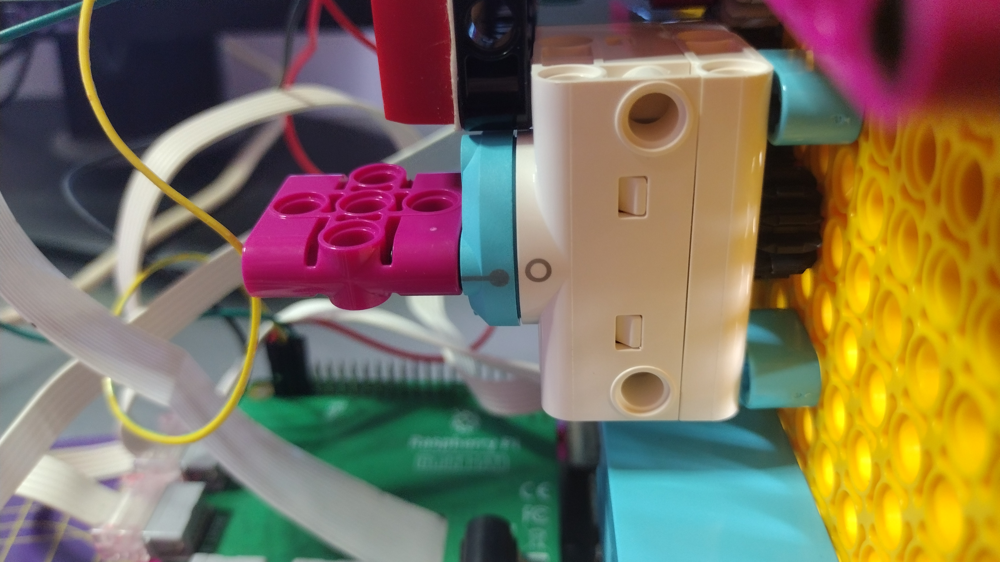

## Program the eyebrows

The third motor is used to move the face's eyebrows.

--- task ---

Set up an object for the eyebrows' motor.

--- code ---
---
language: python filename: robot_face.py line_numbers: true line_number_start: 3
line_highlights: 5
---
mouth_r = Motor('A') mouth_l = Motor('B') eyebrows = Motor('C')

--- /code ---

--- /task ---

--- task ---

Make sure that your large motor is positioned so that the **lollipop** and the **circle** are aligned, and that your face's eyebrows are set horizontally. If they are not, you may need to adjust your build a little.

--- /task ---

--- task ---

Now set the motor to turn to the `0` position when the program starts.

--- code ---
---
language: python filename: robot_face.py line_numbers: true line_number_start: 7
line_highlights: 9
---
mouth_r.run_to_position(0) mouth_l.run_to_position(0) eyebrows.run_to_position(0) --- /code ---

--- /task ---

There are three eyebrow positions that will be shown here, but you can create more.

- `0` will make the eyebrows appear horizontal
- `150` will lower the eyebrows
- `-150` will raise the eyebrows

--- task ---

Add a function that gets the current eyebrow position, and if the position it is supposed to move to is less than the current one, it will move anti-clockwise, otherwise it will move clockwise.

--- code ---
---
language: python filename: line_numbers: true line_number_start: 17
line_highlights:
---
def move_eyebrows (position): current_position = eyebrows.get_aposition() if position < current_position: rotation = 'anticlockwise' else: rotation = 'clockwise' eyebrows.run_to_position(position, direction = rotation)

--- /code ---

--- /task ---

--- task ---

Run your code and test your new function in the **Shell**.

--- code ---
---
language: python filename: line_numbers: false line_number_start:
line_highlights:
---
> > > move_eyebrows(-150) move_eyebrows(150) move_eyebrows(0) --- /code ---

--- /task ---

--- save ---
