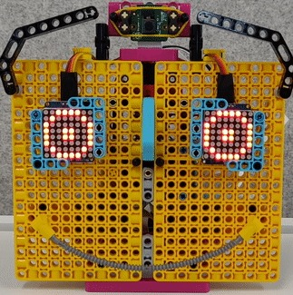

## Introduction

[[[camera-bullseye]]]

Over the course of this project you will construct a robot face from a combination of LEGO® and electronic components. You'll then use an existing machine learning model to help your face recognise different objects and react to them. 

### What you will make

--- no-print ---

Your robot face will be able to recognise and react to a range of objects. Here you can see our example of a robot face.


You should build your robot face using whatever LEGO® and other materials you have available. We used the [LEGO® SPIKE™ Prime kit](https://education.lego.com/en-gb/product/spike-prime).

--- /no-print ---

--- print-only ---



--- /print-only ---

--- collapse ---
---
title: What you will need
---
### Hardware

+ A Raspberry Pi computer
+ A Raspberry Pi Build HAT
+ A Raspberry Pi Camera Module
+ A 30cm Raspberry Pi camera ribbon cable
+ 2× Small LEGO® Technic™ motors
+ 1× Large LEGO® Technic™ motor
+ 1× Mini breadboard
+ 12× Male-to-female jumper wires (20cm)
+ 2× [Adafruit 8×8 LED matrices](https://www.adafruit.com/product/1049) (or similar — requires some soldering to assemble and modify)
+ Extra long stacking header pins
+ Assortment of LEGO® (we used a selection from the [LEGO® SPIKE™ Prime kit](https://education.lego.com/en-gb/product/spike-prime))
+ 20mm F-M header extender.
+ Soldering kit

### Software

Open a terminal and use the following commands to install the needed libraries:

+ BuildHAT Python library for controlling the Build HAT

```
sudo pip3 install buildhat
```

+ TensorFlow Lite library and sample model and labels

```
echo "deb https://packages.cloud.google.com/apt coral-edgetpu-stable main" | sudo tee /etc/apt/sources.list.d/coral-edgetpu.list
curl https://packages.cloud.google.com/apt/doc/apt-key.gpg | sudo apt-key add -
sudo apt-get update
sudo apt-get install python3-tflite-runtime
```

+ Adafruit LED matrix library

```
pip3 install adafruit-circuitpython-ht16k33
```

### Downloads

+ [Image classifier test files](https://rpf.io/p/en/lego-robot-face-go){:target="_blank"}

--- /collapse ---

--- collapse ---
---
title: What you will learn
---

+ To build more complex mechanisms using LEGO®
+ To use a machine learning library to recognise images
+ To use dictionary data structures to control facial expressions

--- /collapse ---

--- collapse ---
---
title: Additional information for educators
---

If you need to print this project, please use the [printer-friendly version](https://projects.raspberrypi.org/en/projects/robot-face/print){:target="_blank"}.

[Here is a link to the resources for this project](https://rpf.io/p/en/lego-robot-face-go){:target="_blank"}.

--- /collapse ---

Before you begin, you'll need to have set up your Raspberry Pi computer and attached your Build HAT:

--- task ---

Mount your Raspberry Pi on to the LEGO Maker Plate using M2 bolts and nuts, making sure the Raspberry Pi is on the side without the 'edge':

 

--- /task ---

Mounting the Raspberry Pi this way round enables easy access to the ports as well as the SD card slot. The Maker Plate will allow you to connect the Raspberry Pi to the main structure of your dashboard more easily.

--- task ---

Line up the Build HAT with the Raspberry Pi, ensuring you can see the `This way up` label. Make sure all the GPIO pins are covered by the HAT, and press down firmly. (The example uses a [stacking header](https://www.adafruit.com/product/2223){:target="_blank"}, which makes the pins longer.)


--- /task ---

You should now power your Raspberry Pi using the 7.5V barrel jack on the Build HAT, which will allow you to use the motors. 

--- task ---

If you have not already done so, set up your Raspberry Pi by following these instructions:

[Setting up your Raspberry Pi](https://projects.raspberrypi.org/en/projects/raspberry-pi-setting-up){:target="_blank"}

--- /task ---

--- task ---

Once the Raspberry Pi has booted, open the Raspberry Pi Configuration tool by clicking on the Raspberry Menu button and then selecting “Preferences” and then “Raspberry Pi Configuration”.

Click on the “interfaces” tab and adjust the Serial settings as shown below:


--- /task ---

--- task ---
You will also need to install the buildhat python library by following these instructions: 

--- collapse ---
---
title: Install the buildhat Python library
---

Open a terminal window on your Raspberry Pi by pressing <kbd>Ctrl</kbd>+<kbd>Alt</kbd>+<kbd>T</kbd>.

At the prompt type: `sudo pip3 install buildhat`

Press <kbd>Enter</kbd> and wait for the "installation completed" message.

--- /collapse ---

--- /task ---
