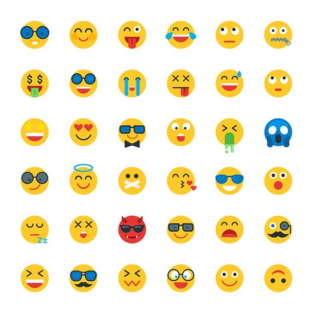

## Use emoji for your robot face

The goal is to build a robotic face that can respond to objects that it recognises. If we break that down into smaller steps we might say that our robot face will:

1. Use the Raspberry Pi camera to look for objects.
2. If an object is detected, use that object to change the face.
3. Match the object detected to a reaction or emotion
4. Change the look of the face to represent a reaction.
5. Return to step 1 to look for the next object to react to.

For the project to work it's going to need a selection of reactions that it can display using simple facial expressions. Emojis are a great example of this.

An emoji is an example of an abstraction, a simplified representation of a real face. All of the complexity has been removed and limited to the simple key parts of the face.

In this project, you can use these five emojis:

|  |  |  |  |  |
| -------------------------- | -------------------------- | -------------------------- | -------------------------- | -------------------------- |
| Happy | Sad | Love | Sleep | Laugh | 

However, if you would like to create your own emojis, you can use [piskel](https://www.piskelapp.com) to create your own 8 x 8 emoji. Only use black and white pixels.

### Connecting objects to expressions

From your experiments in the previous step you will have identified at least five objects that your camera and machine learning model can reliably detect. 

--- task ---

Choose which objects will trigger which reactions in your robot. Each expression should have a reaction associated with it.

For our example we are using: 

| Objects | Reaction |
| ------- | -------- |
| Brocoli | |
| Spider  |  |
| Cat     | 
| Banana  |  |
| Moon    |  |

--- /task ---

