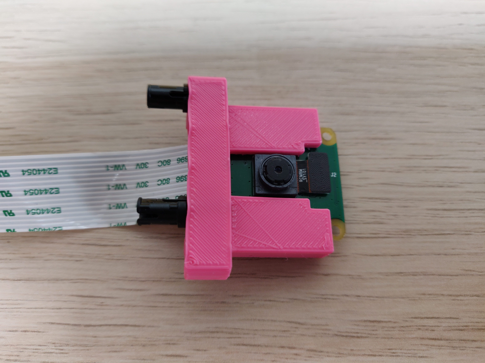
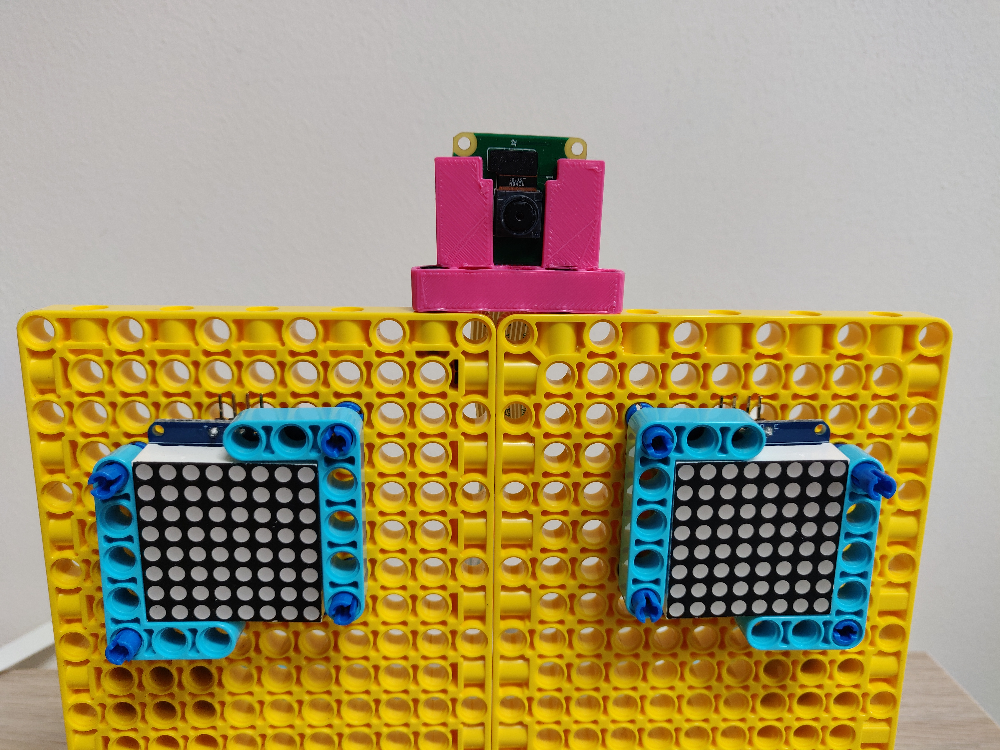

# Making a face

Now that we know which object will trigger whgich responses we need robotic face to animate them with. In this step we're going to walk through an example model, but you should adapt to suit your needs, available resources and ideas.

## Equipment 
For the project your going to need:

- 2 Lego "Powered up" Motors to change the mouth
- A flexible element for the mouth itself
- 2 LED matrix boards (or similar) to display the eyes.
- Raspberry Pi Camera
- Assortment of Lego elements to constuct the face itself.

1. Our first step was to build the main part of the face for which we used 2 panel plates, connected with a series of pins.

  

2. Next some horizontal supports were added to help the face stand up. Here some technic panels were used but, beams or frames would have worked just as well.

  

  

3. Two small motors were added to the rear of the model to control the corners of the mouth. Importantly for the next step the motors' position was set to 0.

  

4. Round the front of the model short axles were attached to 90&deg connectors before being joined with a flexible hose and then mounted in the motors holes.

  

  

5. Next for the eyes a pair of 8x8 LED matrices were used. The 4 connection pins were carefuly bent to 90&deg and then both mounted to the face using 4 double length connector pegs and a pair of 3x5 L shaped beams.

  

  

6. To mount the Raspberry Pi Camera in the model a custom Lego compatible [part](https://www.thingiverse.com/thing:3273396) was found and 3D printed.  

  

  This could then be mounted on top of the Lego face

  

  

  7. The LED matrices were connected via 4 jumper wires to the Raspberry Pi with the cables held in pace by Lego cable clips.

  

  8. The LED matrices were connected to the I2C bus on the Raspberry Pi

  

