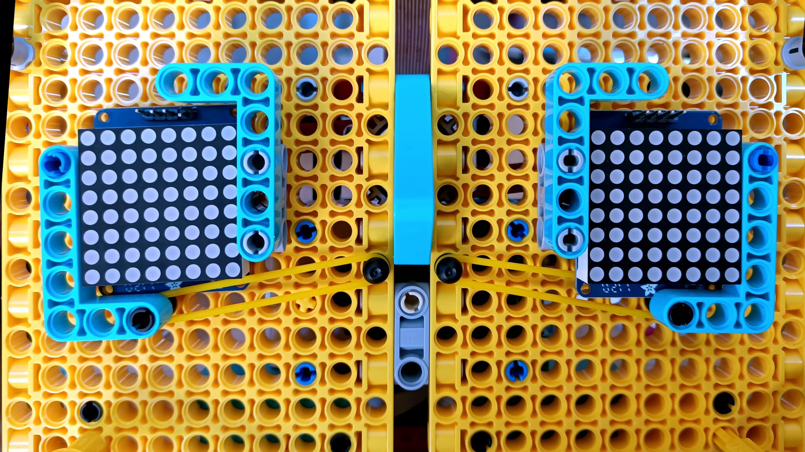

## Adding the eyes

The LED matrices used in the example face connect to the Raspberry pi I2C. Devices using I2C are connected using a specific number called an address. As you are using two matrices, each will need it's own address. 

--- task ---

Before you connect them up you need to follow the relevant [assembly instructions](https://learn.adafruit.com/adafruit-led-backpack/0-8-8x8-matrix-assembly){:target="_blank"}. Assembly of the LED arrays requires some soldering, so get permission from an adult before you use any tools. You can follow our soldering guide here.

<iframe width="560" height="315" src="https://www.youtube.com/embed/8Z-2wPWGnqE" title="YouTube video player" frameborder="0" allow="accelerometer; autoplay; clipboard-write; encrypted-media; gyroscope; picture-in-picture" allowfullscreen></iframe>

--- /task ---

The matrices used in this project all come with the same address, meaning that for 2 to work together, one of them needs a new address. For this some more /soldering is needed.

--- task ---

Using your soldering kit, close the `A0` connection of **only one** of your matrices.

--- /task ---

--- task ---

Place the eyes into the square sockets on your robot face, using elastic bands to secure them and making sure the pins are at the top.

--- /task ---

Now that the basic construction of the robot face is complete we need to add the Raspberry Pi Computer and connect our components to it.