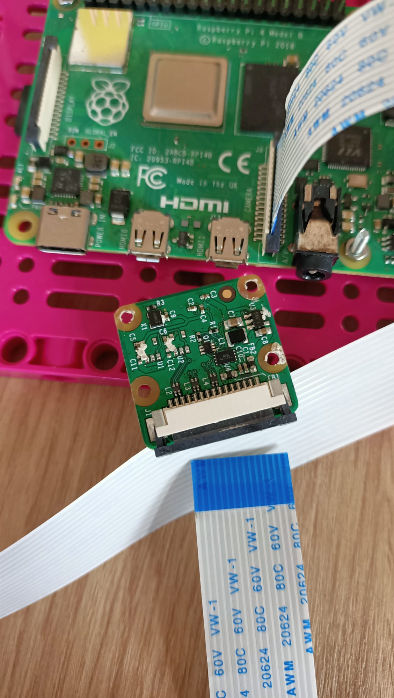
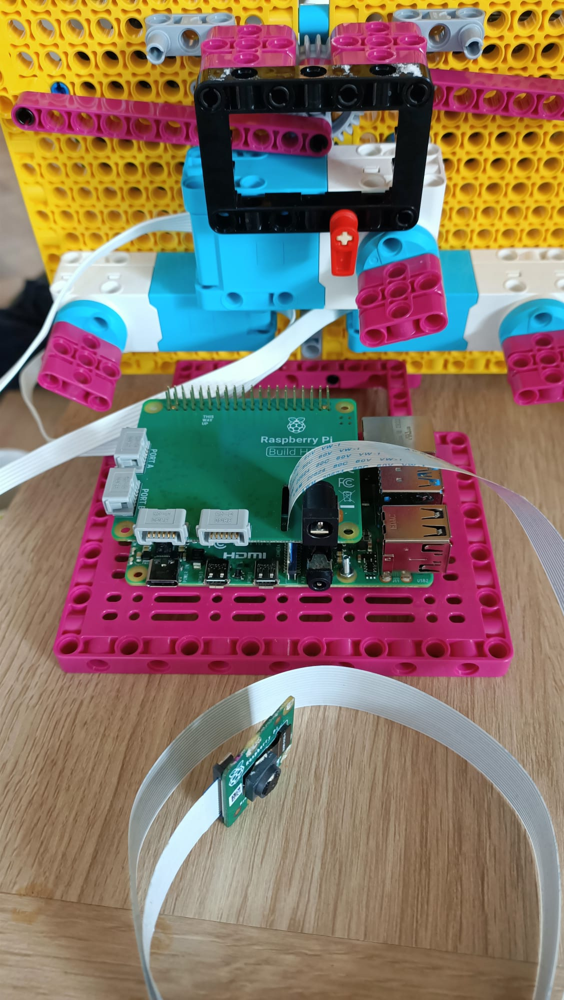
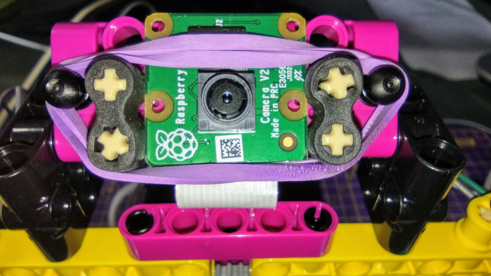

## Adding the Raspberry Pi

For this project you'll ideally want to use the BBE element to mount your Raspberry Pi and Build Hat. For the example model a magenta beam was added to the BBE, this means it fits perfectly between the stands of the face.

--- task ---

Mount your Raspberry Pi to the Maker Plate using M2 bolts and nuts:

 

--- /task ---

Mounting the Raspberry Pi this way round enables easy access to the ports as well as the SD card slot.

### Mounting the camera and BuildHAT

Before adding the BuildHAT you'll first need to attach the camera ribbon cable to the Raspberry Pi and thread it through the hole in the build hat. If you haven't already connected the Camera board to your Pi, you can do so by following these instructions: [Getting started with the Camera Module](https://projects.raspberrypi.org/en/projects/getting-started-with-picamera)

--- task ---
Leave the camera ribbon connected to the Pi, but remove the camera board from the loose end of the ribbon by pushing up the small black clip and sliding the ribbon out:

--- /task ---

--- task ---

Poke the ribbon through the underside of the buildHAT and out through the top, keeping it straight:

--- /task ---

--- task ---

Line up the BuildHAT making sure all the GPIO pins are covered, and press down firmly. (The example uses a [stacking header](https://www.adafruit.com/product/2223){:target="_blank"} which makes the pins longer.)

--- /task ---

--- task ---
Re-attach the camera to the end of the ribbon cable, making sure it is straight. 

--- /task ---

--- task ---
Connect the Maker Plate to the back of your robot face using some black studs.

Mounting the Raspberry Pi this way gives the best access to ports and pins, and means your barrel jack is easily connected for powering the robot face. 

--- /task ---

--- task ---

Connect up your small LEGO Spike motors to ports A and B, ready to control the mouth.

--- /task ---

--- task ---

Connect up your large LEGO motor to port C, ready to control the eyebrows.

--- /task ---

--- task ---

Using the adhesive pad on the bottom, stick a breadboard to the top of the frame supporting the large LEGO motor.

--- /task ---

--- task ---

Mount the camera board in the holder on the top of the robot face, by passing the ribbon under the holder and wedging it between the rubber stoppers on either side. 
Secure it with an elastic band using the black lugs either side. 

--- /task ---

To connect the pair of eyes the the Raspberry Pi GPIO they first need to be connected together using a breadboard and then to the GPIO pins from the Breadboard.

--- task ---

Use 8 Male-Female jumper wires to connect the 4 pins from each eye together on the breadboard. Make sure that both VCC pins are in the same row of the breadboard, both GND pins are in the same row and so on. 

--- /task ---

--- task ---

Using 4 more Male-Female wires connect the 4 pins from the boards to the following GPIO pins on the Build Hat.

- **VCC** to pin **5V**
- **GND** to pin **GND**
- **SDA** to pin **2**
- **SCL** to pin **3**

--- /task ---

Your robot face is now built, connected and ready to be programmed!

