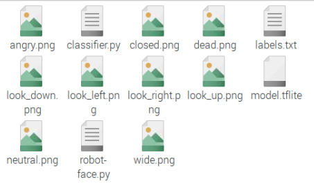

## Motorising the mouth

--- task ---

Open Thonny from the programming menu and save a new file called `robot_face.py`, and make sure to save it in the same directory as `classifier.py`, `labels.txt` and the 8x8 pixel art images.

--- /task ---

--- task ---

Start by adding the import you will need to control the Lego Tecnhic motors.

--- code ---
---
language: python
filename: robot_face.py
line_numbers: true
line_number_start: 
line_highlights: 
---
from buildhat import Motor
--- /code ---

--- /task ---

--- task ---

Create two new objects for the left and right motors. In this example the right motor is connected to Port A and the left to port B.

--- code ---
---
language: python
filename: robot_face.py
line_numbers: true
line_number_start: 
line_highlights: 3,4
---
from buildhat import Motor

mouth_r = Motor('A')
mouth_l = Motor('B')
--- /code ---

--- /task ---

--- task ---

Both motors should start in the `0` position when the program starts.

--- code ---
---
language: python
filename: robot_face,py
line_numbers: true
line_number_start: 5
line_highlights: 
---

mouth_r.run_to_position(0)
mouth_l.run_to_position(0)
--- /code ---

--- /task ---

--- task ---

Create a function that will move the mouth motors. They need to turn in opposite directions, so the left motor will turn to a negative value and the right motor to a positive value. `blocking=False` makes both motors turn at the same time.

--- code ---
---
language: python
filename: robot_face.py
line_numbers: true
line_number_start: 8
line_highlights: 
---
def move_mouth (position, speed=100):
    mouth_l.run_to_position(position * -1, speed, blocking=False) #turn to negative position
    mouth_r.run_to_position(position, speed, blocking=False) #turn to positive position
--- /code ---

--- /task ---

--- task ---

Run your program and then test your new function in the **Shell**

--- code ---
---
language: python
filename: 
line_numbers: false
line_number_start: 
line_highlights: 
---
>>> move_mouth(45)
>>> move mouth(0)
--- /code ---

If your motors move in the wrong direction, try switching their ports.

--- /task ---

--- save ---