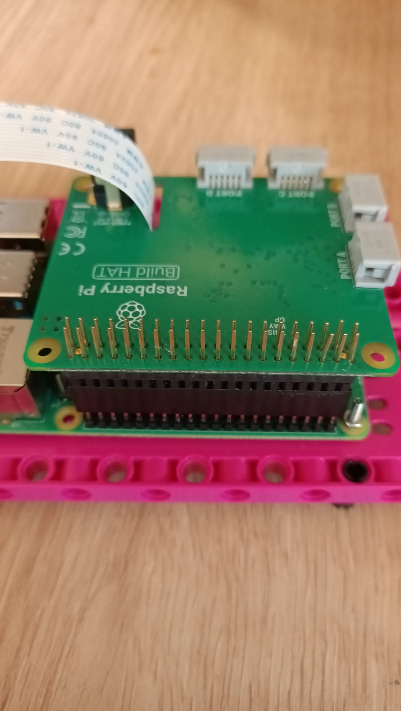
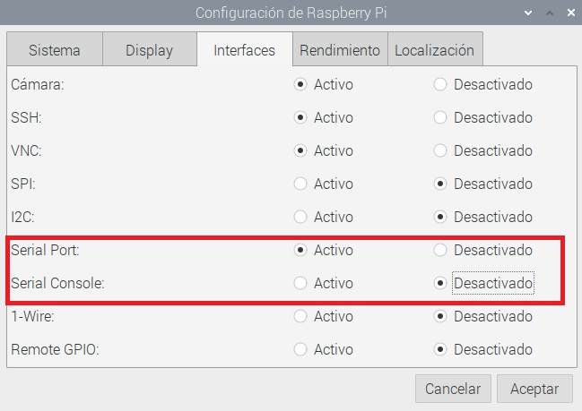

## Introducción

[[[camera-bullseye]]]

En el transcurso de este proyecto, construirás una cara de robot a partir de una combinación de LEGO® y componentes electrónicos. Luego, usará un modelo de aprendizaje automático existente para ayudar a tu cara a reconocer diferentes objetos y reaccionar a ellos.

### Lo que crearás

--- no-print ---

La cara de tu robot podrá reconocer y reaccionar ante una variedad de objetos. Aquí puedes ver nuestro ejemplo de una cara de robot.


Debes construir tu cara de robot usando cualquier LEGO® y otros materiales que tengas disponibles. Nosotros usamos el kit [LEGO® SPIKE ™ Prime](https://education.lego.com/en-gb/product/spike-prime).

--- /no-print ---

--- print-only ---


--- /print-only ---

--- collapse ---
---
title: Lo que necesitarás
---
### Hardware

+ Una computadora Raspberry Pi
+ Un Build HAT Raspberry Pi
+ Un módulo de cámara Raspberry Pi
+ Un cable plano para cámara Raspberry Pi de 30 cm
+ 2 × motores LEGO® Technic ™ pequeños
+ 1 × motor grande LEGO® Technic ™
+ 1 × Mini tablero
+ 12 × cables de puente macho a hembra (20 cm)
+ 2 × [Adafruit 8 × 8 matrices LED](https://www.adafruit.com/product/1049) (o similar; requiere algo de soldadura para ensamblar y modificar)
+ Extensor de cabezal extra largo
+ Surtido de LEGO® (utilizamos una selección del [LEGO® SPIKE ™ Prime](https://education.lego.com/en-gb/product/spike-prime))
+ Extensor de cabezal FM de 20 mm.
+ Kit de soldadura

### Software

Abre una terminal y usa los siguientes comandos para instalar las bibliotecas necesarias:

+ Biblioteca BuildHAT Python para controlar Build HAT

```
sudo pip3 instalar buildhat
```

+ Etiquetas y modelo de muestra y biblioteca de TensorFlow Lite

```
echo "deb https://packages.cloud.google.com/apt coral-edgetpu-stable main" | sudo tee /etc/apt/sources.list.d/coral-edgetpu.list
curl https://packages.cloud.google.com/apt/doc/apt-key.gpg | sudo apt-key add -
sudo apt-get update
sudo apt-get install python3-tflite-runtime
```

+ Biblioteca de matrices LED Adafruit

```
pip3 install adafruit-circuitpython-ht16k33
```

### Descargas

+ [Archivos de prueba del clasificador de imágenes](https://rpf.io/p/es-ES/lego-robot-face-go){:target="_blank"}

--- /collapse ---

--- collapse ---
---
title: Lo que aprenderás
---

+ Para construir mecanismos más complejos usando LEGO®
+ Para usar una biblioteca de aprendizaje automático para reconocer imágenes
+ Usar estructuras de datos de diccionario para controlar expresiones faciales

--- /collapse ---

--- collapse ---
---
title: Información adicional para educadores
---

Si necesitas imprimir este proyecto, usa la [versión para imprimir](https://projects.raspberrypi.org/es-ES/projects/robot-face/print){:target="_blank"}.

[Aquí hay un enlace a los recursos para este proyecto](https://rpf.io/p/es-ES/lego-robot-face-go){:target="_blank"}.

--- /collapse ---

Antes de comenzar, deberás configurar tu computadora Raspberry Pi e instalar el Build HAT:

--- task ---

Monta tu Raspberry Pi en la placa de construcción LEGO usando pernos y tuercas M2, asegurándote de que la Raspberry Pi esté en el lado sin borde':

 

--- /task ---

Montar la Raspberry Pi de esta manera permite un fácil acceso a los puertos, así como a la ranura de la tarjeta SD. La placa de construcción te permitirá conectar la Raspberry Pi a la estructura principal de tu tablero más fácilmente.

--- task ---

Alinea el Build HAT con la Raspberry Pi, asegurándote de que puedes ver la etiqueta `This way up`. Asegúrate de que todos los pines GPIO estén cubiertos por el HAT y presiona firmemente. (El ejemplo usa una [cabecera de apilamiento ](https://www.adafruit.com/product/2223){:target="_blank"}, lo que alarga los pines)

 

--- /task ---

Ahora debes encender tu Raspberry Pi utilizando el conector de barril de 7.5V en el Build HAT, lo cual te permitirá usar los motores.

--- task ---

Si aún no lo ha hecho, configura tu Raspberry Pi siguiendo estas instrucciones:

[Configurando tu Raspberry Pi](https://projects.raspberrypi.org/es-ES/projects/raspberry-pi-setting-up){:target="_blank"}

--- /task ---

--- task ---

Una vez que la Raspberry Pi se haya iniciado, abre la herramienta de configuración de Raspberry Pi haciendo clic en el botón Menú de Raspberry y luego seleccionando "Preferencias" y luego "Configuración de Raspberry Pi".

Haz clic en la pestaña "interfaces" y ajusta la configuración Serie como se muestra a continuación:



--- /task ---

--- task ---
También necesitarás instalar la biblioteca buildhat de python siguiendo estas instrucciones:

--- collapse ---
---
title: Instale la biblioteca buildhat Python
---

Abre una ventana de terminal en tu Raspberry Pi presionando <kbd>Ctrl</kbd>+<kbd>Alt</kbd>+<kbd>T</kbd>.

En el indicador, escribe: `sudo pip3 install buildhat`

Presiona <kbd>Entrar</kbd> y espera el mensaje "installation completed".

--- /collapse ---

--- /task ---
