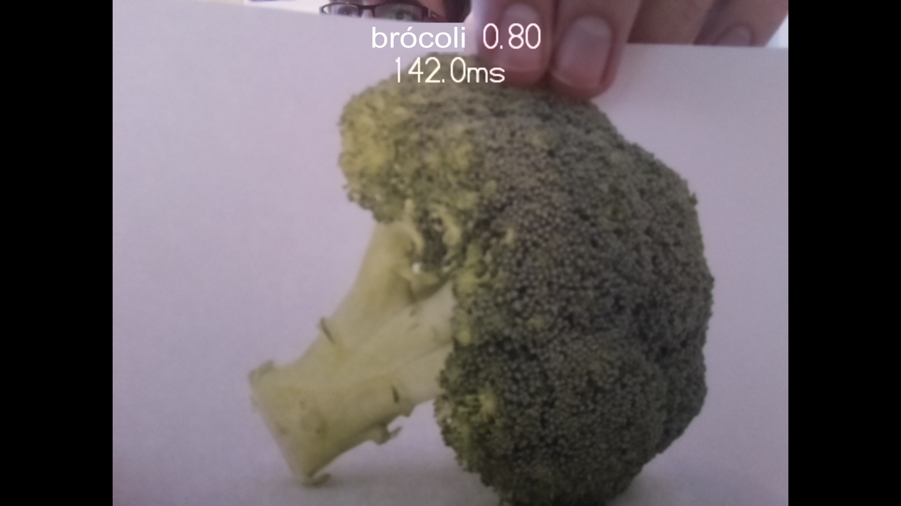

## Prueba el modelo de aprendizaje automático

Tu primer paso es comprender y probar cómo puedes usar un modelo de aprendizaje automático para reconocer objetos. Para este proyecto, no crearás ni entrenarás tu propio modelo, sino que utilizarás un modelo de ejemplo que pueda reconocer una variedad de objetos.

Antes de comenzar, tienes que haber configurado tu computadora Raspberry Pi y conectado una cámara Raspberry Pi. Puedes encontrar instrucciones sobre cómo hacer ambas cosas en las siguientes guías:

--- task --- Conecta un módulo de cámara Raspberry Pi a tu Raspberry Pi siguiendo estas instrucciones:

[Introducción al módulo de la cámara](https://projects.raspberrypi.org/en/projects/getting-started-with-picamera){: target = "_ blank"}

--- /task ---

Las computadoras no tienen una habilidad natural para aprender. La mayoría de las cosas que hacen las computadoras han sido programadas directamente por un ser humano. Esto las hace excelentes para tareas que tienen algunas reglas claramente definidas, pero se les complican las tareas más similares a las humanas, como reconocer diferentes objetos.

Mediante el aprendizaje automático, se le puede mostrar miles y miles de imágenes, etiquetadas a una computadora. Poco a poco, el programa puede aprender las características de un grupo de imágenes y luego darles la etiqueta correcta.

El resultado final de este proceso se llama modelo. Una vez entrenados, los modelos se pueden utilizar en el mundo real para realizar tareas. 

### Probando un modelo

--- task ---

 Para comenzar, descarga los recursos para este proyecto en su Raspberry Pi [haciendo clic aquí](http://rpf.io/p/en/robot-face-go){: target = "_ blank"}.

 --- /task ---

 --- task ---

 Descomprime los archivos y luego mueve el directorio descomprimido a tu directorio `/home /pi`.

 --- /task ---

 Encontrarás una variedad de archivos que serán útiles para el proyecto, pero para este paso, usarás:

 - `model.tflite` : el archivo del modelo de aprendizaje automático
 - `labels.txt` : etiquetas para cada objeto que el modelo puede reconocer
 - `classifer.py` - Un programa de Python para probar el modelo

--- task ---

Abre **Thonny**, que se encuentra en el menú **Programar** en el **menú Inicio** de tu Raspberry Pi.

 --- /task ---

--- task ---

Abre y **Ejecuta** el programa`classifier.py`.

Tu Raspberry Pi mostrará:
+ Qué está "viendo" la cámara
+ El nombre del objeto principal a la vista de que reconoce

 

--- /task ---

--- task ---

 **Intenta** presentar a la cámara diferentes objetos e investiga cuáles puede reconocer con confianza.

 Mientras haces esto, experimenta con:
   - **El fondo**: la cámara puede reconocer objetos en lugar del objeto que sostienes frente a la cámara.
   - **Posición del objeto**: dónde y cómo sostienes el objeto puede afectar la forma en que se reconoce. Experimenta con la distancia de la cámara y gira el objeto en diferentes direcciones.
   - **Iluminación**: La iluminación de tu habitación puede afectar la detección de un objeto. Intenta encender más luces o apagar algunas luces.
   - **Imágenes**: puede ser útil mostrar a la cámara imágenes impresas de objetos en lugar de los objetos en sí.

--- /task ---

--- task ---

Busca **al menos** cuatro objetos (o imágenes) que tu cámara pueda reconocer de manera confiable; los necesitarás para tu modelo de aprendizaje automático.

--- /task ---

--- save ---
