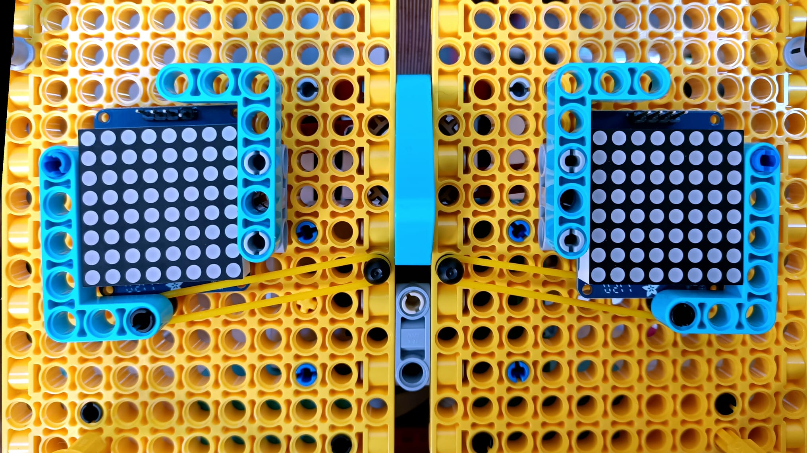

## Agrega los ojos

Las matrices de LED utilizadas en la cara de ejemplo se conectan a la Raspberry Pi I2C. Los dispositivos que utilizan I2C se conectan mediante un número específico llamado dirección. Como estás utilizando dos matrices, cada una necesitará su propia dirección. 

--- task ---

Antes de conectarlos, debes seguir las [instrucciones de montaje](https://learn.adafruit.com/adafruit-led-backpack/0-8-8x8-matrix-assembly){: target = "_ blank"}. El ensamblaje de las matrices de LED requiere algo de soldadura, así que pide permiso a un adulto antes de usar cualquier herramienta. Puedes seguir nuestra guía de soldadura aquí. <iframe width="560" height="315" src="https://www.youtube.com/embed/8Z-2wPWGnqE" title="Reproductor de video de YouTube" frameborder="0" allow="accelerometer; autoplay; clipboard-write; encrypted-media; gyroscope; picture-in-picture" allowfullscreen mark="crwd-mark"></iframe>

--- /task ---

Todas las matrices utilizadas en este proyecto vienen con la misma dirección, lo que significa que para que dos trabajen juntas, una de ellas necesita una nueva dirección. Para esto, se necesita un poco más de soldadura.

--- task ---

Usando tu kit de soldadura, cierra la conexión `A0` en **solo una** de tus matrices.

--- /task ---

--- task ---

Coloca los ojos en las cuencas cuadradas de la cara de tu robot; usa bandas elásticas para asegurarlos y asegúrate de que los pines estén en la parte superior.

--- /task ---

Ahora que la construcción básica de la cara del robot está completas, debe agregar la computadora Raspberry Pi y conectarle tus componentes.
