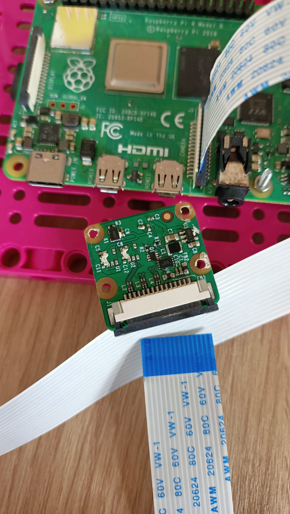

## Agrega la Raspberry Pi

Para este proyecto, idealmente querrás usar el elemento Build Plate (placa de construcción) para montar su Raspberry Pi y Build HAT:

--- task ---

Monta tu Raspberry Pi en la placa de construcción usando pernos y tuercas M2, asegurándote de que la Pi esté en el lado plano:

 

--- /task ---

Montar la Raspberry Pi de esta manera permite un fácil acceso a los puertos, así como a la ranura de la tarjeta SD.

### Monta la cámara y BuildHAT

Antes de agregar el Build HAT, primero deberás conectar el cable plano de la cámara a la Raspberry Pi y pasarlo por el orificio del Build HAT. Si aún no has conectado la placa de la cámara a tu Raspberry Pi, puedes hacerlo siguiendo estas instrucciones: [Introducción al módulo de la cámara](https://projects.raspberrypi.org/en/projects/getting-started-with-picamera){: target = "_ blank"}.

--- task ---

Deja la cinta de la cámara conectada a la Raspberry Pi, pero retira la placa de la cámara del extremo suelto de la cinta empujando hacia arriba el pequeño clip negro y deslizando la cinta hacia afuera:

--- /task ---

--- task ---

Empuja la cinta a través de la parte inferior del Build HAT y hacia afuera por la parte superior, asegurándote de que la cinta no esté torcida: 

--- /task ---

--- task ---

Alinea el Build HAT con la Raspberry Pi, asegurándote de que puedes ver la etiqueta `This way up`. Asegúrate de que todos los pines GPIO estén cubiertos por el HAT y presiona firmemente. (El ejemplo usa una [cabecera de apilamiento ](https://www.adafruit.com/product/2223){: target = "_ blank"}, lo que alarga los pines)

--- /task ---

--- task --- Vuelve a conectar la cámara al extremo del cable plano, asegurándote de que no esté torcido.

--- /task ---

--- task --- Conecta la placa de construcción a la parte posterior de la cara de tu robot con unos tacos negros. 

Montar la Raspberry Pi de esta manera brinda el mejor acceso a los puertos y pines, y significa que tu conector de barril se conecta fácilmente para alimentar la cara del robot.

--- /task ---

--- task ---

Conecta tus pequeños motores LEGO® Technic ™ a los puertos A y B, listos para controlar la boca.

--- /task ---

--- task ---

Conecta tu gran motor LEGO® Technic ™ al puerto C, listo para controlar las cejas.

--- /task ---

--- task ---

Usando la almohadilla adhesiva en la parte inferior, pega una placa de pruebas a la parte superior del marco que soporta el motor LEGO® grande.

--- /task ---

--- task ---

Monta la placa de la cámara en el soporte en la parte superior de la cara del robot pasando la cinta por debajo del soporte y encajando la cámara entre los topes de goma a cada lado.

Asegura la cámara con una banda elástica usando las orejetas negras a cada lado.

--- /task ---

Para conectar el par de ojos a la Raspberry Pi GPIO, primero deben conectarse entre sí mediante una placa de pruebas y luego a los pines GPIO de la placa de pruebas.

--- task ---

Utiliza ocho cables de puente macho-hembra para conectar los cuatro pines de cada ojo a la placa de pruebas. Asegúrate de que ambos pines VCC estén en la misma fila de la placa de pruebas, ambos pines GND estén en la misma fila, y así sucesivamente. Luego, conéctalo a los pines 3V3, GND, SDA y SCL de la Raspberry Pi, como se muestra a continuación.

--- /task ---

¡Tu cara de robot ahora está construida, conectada y lista para ser programada!

