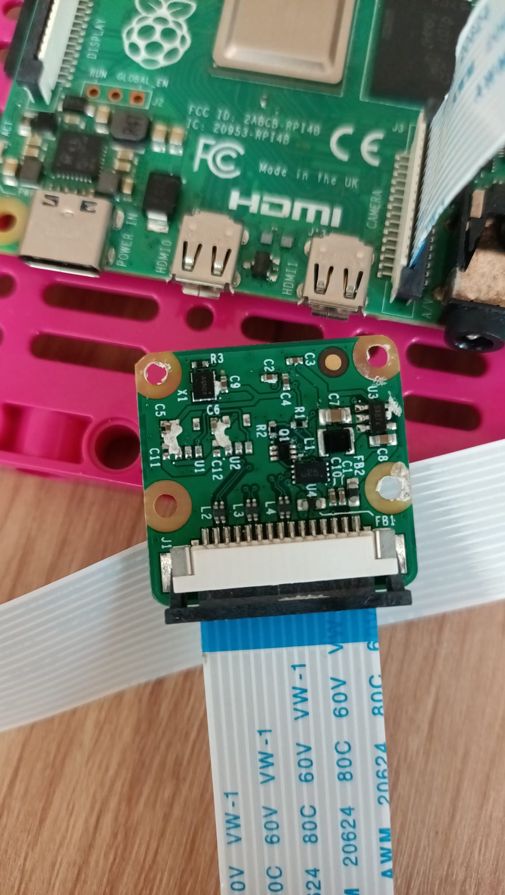
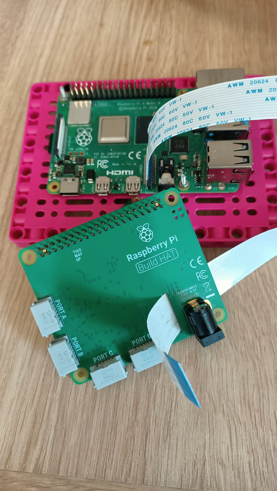

## Agrega la Raspberry Pi

Para este proyecto, idealmente querrá usar el elemento Build Plate para montar su Raspberry Pi y Build HAT:

--- task ---

Monte su Raspberry Pi en la placa de construcción usando pernos y tuercas M2, asegurándose de que el Pi esté en el lado plano:

 

--- /task ---

Montar la Raspberry Pi de esta manera permite un fácil acceso a los puertos, así como a la ranura de la tarjeta SD.

### Monte la cámara y compile HAT

Antes de agregar el Build HAT, primero deberá conectar el cable plano de la cámara a la Raspberry Pi y pasarlo por el orificio del Build HAT. Si aún no ha conectado la placa de la cámara a su Raspberry Pi, puede hacerlo siguiendo estas instrucciones: [Introducción al módulo de la cámara](https://projects.raspberrypi.org/en/projects/getting-started-with-picamera){: target = "_ blank"}.

--- task ---

Deje la cinta de la cámara conectada a la Raspberry Pi, pero retire la placa de la cámara del extremo suelto de la cinta empujando hacia arriba el pequeño clip negro y deslizando la cinta hacia afuera:

--- /task ---

--- task ---

Empuje la cinta a través de la parte inferior del Build HAT y hacia afuera por la parte superior, asegurándose de que la cinta no esté torcida: 

--- /task ---

--- task ---

Alinee Build HAT con Raspberry Pi, asegurándose de que pueda ver la etiqueta `This way up` Asegúrese de que todos los pines GPIO estén cubiertos por el SOMBRERO y presione firmemente. (El ejemplo usa un encabezado de apilamiento {: target = "_ blank"}, lo que alarga los pines).

--- /task ---

--- tarea --- Vuelva a conectar la cámara al extremo del cable plano, asegurándose de que no esté torcido.

--- /task ---

--- tarea --- Conecte la placa de construcción a la parte posterior de la cara de su robot con unos tacos negros. 

Montar la Raspberry Pi de esta manera brinda el mejor acceso a los puertos y pines, y significa que su conector de barril se conecta fácilmente para alimentar la cara del robot.

--- /task ---

--- task ---

Conecte sus pequeños motores LEGO® Technic ™ a los puertos A y B, listo para controlar la boca.

--- /task ---

--- task ---

Conecte su gran motor LEGO® Technic ™ al puerto C, listo para controlar las cejas.

--- /task ---

--- task ---

Usando la almohadilla adhesiva en la parte inferior, pegue una placa de pruebas en la parte superior del marco que soporta el motor LEGO® grande.

--- /task ---

--- task ---

Monte la placa de la cámara en el soporte en la parte superior de la cara del robot pasando la cinta por debajo del soporte y encajando la cámara entre los tapones de goma a cada lado.

Asegure la cámara con una banda elástica usando las orejetas negras a cada lado.

--- /task ---

Para conectar el par de ojos a la Raspberry Pi GPIO, primero deben conectarse entre sí mediante una placa de pruebas y luego a los pines GPIO de la placa de pruebas.

--- task ---

Utilice ocho cables de puente macho-hembra para conectar los cuatro pines de cada ojo en la placa de pruebas. Asegúrese de que ambos pines VCC estén en la misma fila de la placa de pruebas, ambos pines GND estén en la misma fila, y así sucesivamente. Luego, conéctelo a los pines 3V3, GND, SDA y SCL de la Raspberry Pi, como se muestra a continuación.

--- /task ---

¡Su cara de robot ahora está construida, conectada y lista para ser programada!

