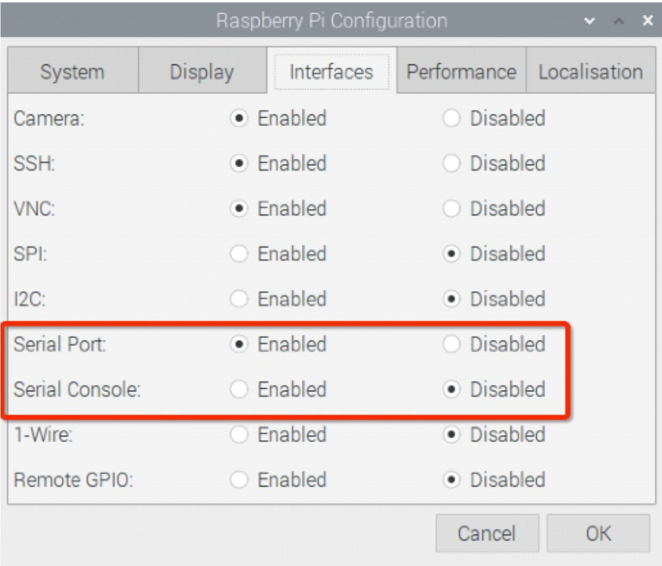

## はじめに

このプロジェクトの過程で、LEGO®と電子部品の組み合わせからロボットの顔を構築します。 次に、既存の機械学習モデルを使用して、顔がさまざまなオブジェクトを認識し、それらに反応するのを支援します。

### 作るもの

--- no-print ---

ロボットの顔は、さまざまなオブジェクトを認識して反応することができます。 ここでは、ロボットの顔の例を見ることができます。


入手可能なLEGO®やその他の素材を使用して、ロボットの顔を作成する必要があります。 私たちは、使用 [レゴSPIKE™プライムキット](https://education.lego.com/en-gb/product/spike-prime)。

--- /no-print ---

--- print-only ---


--- /print-only ---

--- collapse ---
---
title: 必要なもの
---
### ハードウェア

+ RaspberryPiコンピューター
+ ラズベリーパイビルドHAT
+ RaspberryPiカメラモジュール
+ 30cm RaspberryPiカメラリボンケーブル
+ 2×小型LEGO®Technic™モーター
+ 1×大型LEGO®Technic™モーター
+ 1×ミニブレッドボード
+ 12×オス-メスジャンパー線（20cm）
+ 2× [Adafruitは、8×8 LEDマトリックス](https://www.adafruit.com/product/1049) （または同様の-アセンブルおよび変更するために、いくつかのはんだ付けを必要とします）
+ 非常に長いスタッキングヘッダーピン
+ レゴの品揃え（私たちはから選択を使用 [レゴSPIKE™プライムキット](https://education.lego.com/en-gb/product/spike-prime)）
+ 20mmFMヘッダーエクステンダー。
+ はんだ付けキット

### ソフトウェア

ターミナルを開き、次のコマンドを使用して必要なライブラリをインストールします。

+ BuildHATを制御するためのBuildHATPythonライブラリ

```
sudo pip3 install buildhat
```

+ TensorFlowLiteライブラリとサンプルモデルおよびラベル

```
echo "deb https://packages.cloud.google.com/apt coral-edgetpu-stable main" | sudo tee /etc/apt/sources.list.d/coral-edgetpu.list
curl https://packages.cloud.google.com/apt/doc/apt-key.gpg | sudo apt-key add-
sudo apt-get update
sudo apt-get install python3-tflite-runtime
```

+ AdafruitLEDマトリックスライブラリ

```
pip3 install adafruit-circuitpython-ht16k33
```

### ダウンロード

+ [画像分類器テストファイル](http://rpf.io/p/en/lego-robot-face-go){：target = "_ blank"}

--- /collapse ---

--- collapse ---
---
title: 学習すること
---

+ LEGO®を使用してより複雑なメカニズムを構築するには
+ 機械学習ライブラリを使用して画像を認識する
+ 辞書のデータ構造を使用して顔の表情を制御するには

--- /collapse ---

--- collapse ---
---
title: 教育者向けの追加情報
---

このプロジェクトを印刷する必要がある場合は、 [印刷用バージョン](https://projects.raspberrypi.org/en/projects/robot-face/print){:target="_ blank"}を使用してください。

[このプロジェクトのリソースへのリンクは](http://rpf.io/p/en/robot-face-go){：target = "_blank"}。

--- /collapse ---

始める前に、Raspberry Piコンピューターをセットアップし、BuildHATを接続する必要があります。

--- task ---

M2ボルトとナットを使用してRaspberryPiをLEGOBuild Plateに取り付け、RaspberryPiが「エッジ」のない側にあることを確認します。

 

--- /task ---

Raspberry Piをこのように取り付けると、ポートとSDカードスロットに簡単にアクセスできます。 ビルドプレートを使用すると、RaspberryPiをダッシュボードの主要構造に簡単に接続できます。

--- task ---

あなたが見ることができます確保、ラズベリーパイとビルドHATをラインアップ `までこの道を` ラベル。 すべてのGPIOピンがHATで覆われていることを確認し、しっかりと押し下げます。 （この例では、 [スタッキングヘッダー](https://www.adafruit.com/product/2223){：target = "_ blank"}を使用しているため、ピンが長くなります。）

 

--- /task ---

これで、BuildHATの7.5Vバレルジャックを使用してRaspberryPiに電力を供給する必要があります。これにより、モーターを使用できるようになります。

--- task ---

まだ行っていない場合は、次の手順に従ってRaspberryPiをセットアップします。

[Raspberry Piのセットアップ](https://projects.raspberrypi.org/en/projects/raspberry-pi-setting-up){:target="_ blank"}

--- /task ---

--- task ---

Raspberry Piが起動したら、[Raspberry Menu]ボタンをクリックし、[Preferences]、[Raspberry Pi Configuration]の順に選択して、Raspberry PiConfigurationツールを開きます。

「インターフェース」タブをクリックし、以下に示すようにシリアル設定を調整します。



--- /task ---

---タスク--- 次の手順に従って、buildhatpythonライブラリをインストールする必要もあります。

--- collapse ---
---
タイトル：buildhatPythonライブラリをインストールします
---

<kbd>Ctrl</kbd>+<kbd>Alt</kbd>+<kbd>T</kbd>押して、RaspberryPiでターミナルウィンドウを開きます。

プロンプトタイプ： `sudo pip3 install buildhat`

押して <kbd>入力</kbd> と待ちのメッセージを「インストールが完了しました」。

--- /collapse ---

--- /task ---