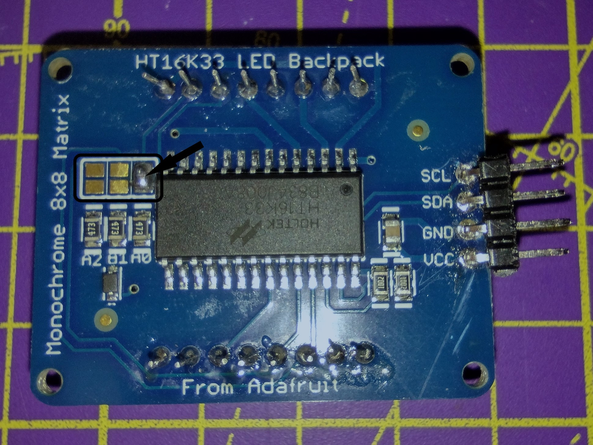

## 目を追加する

今回の顔で使用されている LED マトリクスは、 Raspberry Pi に I2C で接続します。 I2C を使用するデバイスは、アドレスと呼ばれる特定の番号を使用して接続されます。 2つのマトリックスを使用するため、それぞれに別のアドレスが必要になります。 

--- task ---

接続する前に、関連する[組み立て手順](https://learn.adafruit.com/adafruit-led-backpack/0-8-8x8-matrix-assembly){:target="_blank"}に従う必要があります。 LED アレイの組み立てにははんだ付けが必要なため、工具を使用する前には大人の許可をもらいましょう。 こちらのはんだ付けガイドに従ってください。

<iframe width="560" height="315" src="https://www.youtube.com/embed/8Z-2wPWGnqE" title="YouTube ビデオプレーヤー" frameborder="0" allow="accelerometer; autoplay; clipboard-write; encrypted-media; gyroscope; picture-in-picture" allowfullscreen></iframe>

--- /task ---

このプロジェクトで使用するマトリックスはすべて同じアドレスを持っています。そのため、2つとも一緒に動かすには、片方に新しいアドレスが必要です。 そのためには、もう少しはんだ付けがいります。

--- task ---

はんだ付けキットを使用して、 **片方の**マトリックスの `A0` の接続を閉じます。

--- /task ---

--- task ---

ロボットの顔の四角いソケットに目を置きます。ゴムバンドを使用して固定し、ピンが上部にあることを確認します。

--- /task ---

ロボットの顔の基本的な構築が完了したので、 Raspberry Pi を追加し、コンポーネントを接続していきましょう。
