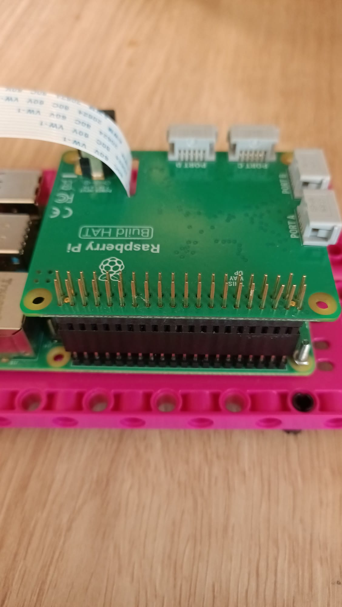

## Raspberry Pi を追加する

このプロジェクトでは、メイカープレートのエレメントを使って Raspberry Pi と Build HAT をマウントするのが理想的です。

--- task ---

M2のボルトとナットを使用して、 LEGO メイカープレートの上にRaspberry Piを取り付けます。 Raspberry Piはふちがない方の面に載せます:

 

--- /task ---

写真のとおりにRaspberry Piを固定することで、SDカードスロットが扱いやすくなります。

### カメラ とBuild HAT を取り付ける

Build HAT を追加する前に、カメラのリボンケーブルを Raspberry Pi に接続して、 Build HAT の穴に通します。 カメラボードをまだ Raspberry Pi に接続していない場合は、次の手順に従って接続します: [カメラモジュールを始めよう](https://projects.raspberrypi.org/ja-JP/projects/getting-started-with-picamera){:target="_blank"}

--- task ---

カメラリボンを Raspberry Pi に接続したまま、カメラボード側を取り外します。小さな黒いクリップを押し上げてリボンケーブルの端を緩め、リボンを引き出します:

--- /task ---

--- task ---

Build HAT の下側からリボンを差し込み、上部から引き出します。リボンがねじれていないことを確認します: 

--- /task ---

--- task ---

`This way up` の文字が見えるようにBuild HATをRaspberry Piと並べます。 全部のGPIOピンがHATにかぶるよう合わせて、しっかり押し下げてください。 (例ではピンが長くなる [スタッキングヘッダー](https://www.adafruit.com/product/2223){:target="_blank"}, を使用しています。)

--- /task ---

--- task ---
リボンケーブルの端にカメラを再度取り付けます。ねじれていないことを確認します。

--- /task ---

--- task ---
黒いスタッドをいくつか使用して、メイカープレートをロボックの顔の後ろにつなぎます。 

この方法で Raspberry Pi を取り付けると、ポートとピンへのアクセスが最適になり、バレルジャックを簡単に接続してロボットの顔に電力が供給できます。

--- /task ---

--- task ---

小さい LEGO® Technic™ モーターをポート A とポート B に接続して、口を制御するための準備をします。

--- /task ---

--- task ---

大きい LEGO® Technic™ モーターをポート C に接続し、眉毛を制御するための準備をします。

--- /task ---

--- task ---

大きい LEGO® モーターを支えているフレームの上部に、ブレッドボードを裏面の粘着パッドを使用して貼り付けます。

--- /task ---

--- task ---

ホルダーの下にリボンを通し、両側のゴム栓の間にカメラをはさむようにして、ロボットの顔の上部にあるホルダーにカメラボードを取り付けます。

両側の黒いラグを使用して、カメラをゴムバンドで固定しましょう。

--- /task ---

両方の目を Raspberry Pi の GPIO に接続するには、最初にブレッドボードに目を接続し、次にブレッドボードから GPIO ピンに接続します。

--- task ---

それぞれの目にある4つのピンを、ブレッドボード上で一緒に接続するために、オス - メスジャンパー線を8本使用します。 両方の VCC ピンがブレッドボードの同じ行にあることと、両方の GND ピンが同じ行にあることなどを確認しましょう。 そして、以下に示すように、 Raspberry Pi の 3V3 、 GND 、 SDA 、 SCL ピンに接続します。

--- /task ---

これでロボットの顔の作成と接続が済んだので、プログラミングの準備が整いました！

