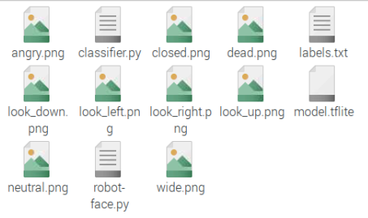

## 口を動かす

--- task ---

オープン **Thonny** プログラミングメニューから、新しいファイルの保存と呼ばれる `robot_face.py`、および同じディレクトリに保存することを確認してください `classifier.py`、 `labels.txt`、および8×8ピクセルアート画像。

--- /task ---

--- task ---

インポートを追加することから始め、LEGO®Technic™モーターを制御する必要があります。

--- code ---
---
language: python filename: robot_face.py line_numbers: true line_number_start:
line_highlights:
---
from buildhat import Motor --- /code ---

--- /task ---

--- task ---

左右のモーター用に2つの新しいオブジェクトを作成します。 この例では、右側のモーターはポートAに接続され、左側のモーターはポートBに接続されています。

--- code ---
---
language: python filename: robot_face.py line_numbers: true line_number_start:
line_highlights: 3,4
---
from buildhat import Motor

mouth_r =モーター（ 'A'） mouth_l =モーター（ 'B'） --- /コード---

--- /task ---

--- task ---

両方のモータはで開始する必要があります `0` プログラムの起動時に位置。

--- code ---
---
language: python filename: robot_face,py line_numbers: true line_number_start: 5
line_highlights:
---

mouth_r.run_to_position（0） mouth_l.run_to_position（0） --- /コード---

--- /task ---

--- task ---

口のモーターを動かす関数を作成します。 それらは反対方向に回転する必要があるため、左側のモーターは負の値に回転し、右側のモーターは正の値に回転します。 `ブロッキング= False` を追加すると、両方のモーターが同時に回転します。

--- code ---
---
language: python filename: robot_face.py line_numbers: true line_number_start: 8
line_highlights:
---
DEF move_mouth（位置、速度= 100）： mouth_l.run_to_position（位置* -1、速度、ブロッキング=偽）#Turn負の位置に mouth_r.run_to_position（遮断位置、速度、=偽）#Turn正位置に --- / code ---

--- /task ---

--- task ---

あなたのプログラムを実行し、その後に新しい機能をテスト **シェル**。

--- code ---
---
言語：python ファイル名： line_numbers：false line_number_start：
line_highlights:
---
> > > move_mouth（45） movemouth（0） --- / code ---

モーターが間違った方向に動く場合は、ポートを切り替えてみてください。

--- /task ---

--- save ---
