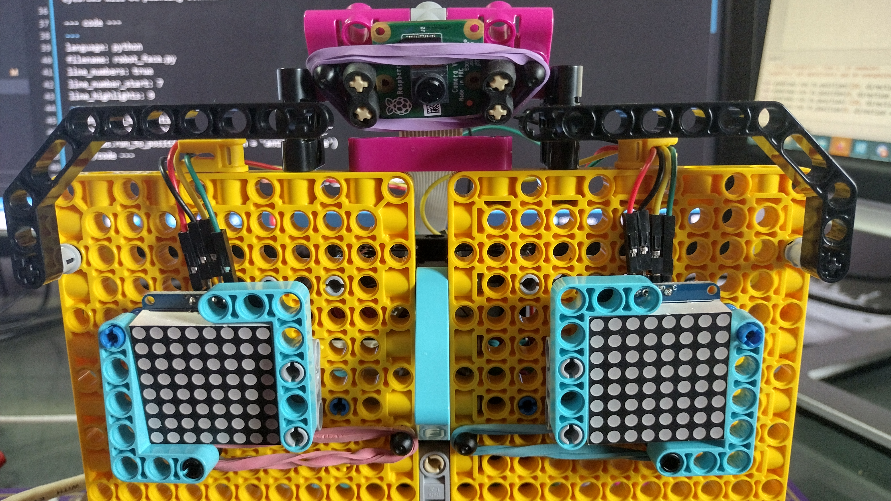

## 眉毛をプログラムする

3番目のモーターは、顔の眉毛を動かすために使用されます。

--- task ---

眉毛のモーターのオブジェクトを設定します。

--- code ---
---
language: python filename: robot_face.py line_numbers: true line_number_start: 3
line_highlights: 5
---
mouth_r =モーター（ 'A'） mouth_l =モーター（ 'B'） 眉毛=モーター（ 'C'）

--- /code ---

--- /task ---

--- task ---

**ロリポップ** と **サークル** が揃うように大きなモーターが配置されていること、および顔の眉毛が水平に設定されていることを確認してください。 そうでない場合は、ビルドを少し調整する必要があります。

--- /task ---

--- task ---

今すぐに有効にモーターをセット `0` プログラムの起動時に位置。

--- code ---
---
language: python filename: robot_face.py line_numbers: true line_number_start: 7
line_highlights: 9
---
mouth_r.run_to_position（0） mouth_l.run_to_position（0） eyebrows.run_to_position（0） --- / code ---

--- /task ---

ここに表示される眉の位置は3つありますが、さらに作成することもできます。

- `0` は、眉を水平に見せます
- `150` 眉を低下さ
- `-150` 眉を上げます

--- task ---

現在の眉の位置を取得する関数を追加します。移動先の位置が現在の位置よりも小さい場合は反時計回りに移動し、そうでない場合は時計回りに移動します。

--- code ---
---
language: python filename: line_numbers: true line_number_start: 17
line_highlights:
---
DEF move_eyebrows（位置）： current_position = eyebrows.get_aposition（）、 であれば、位置 < current_position： 回転= '反時計' 他： 回転= '時計回り' eyebrows.run_to_position（位置、方向=回転）

--- /code ---

--- /task ---

--- task ---

あなたのコードを実行し、中にあなたの新しい機能テスト **シェル**。

--- code ---
---
language: python filename: line_numbers: false line_number_start:
line_highlights:
---
> > > move_eyebrows（-150） move_eyebrows（150） move_eyebrows（0） --- / code ---

--- /task ---

--- save ---
