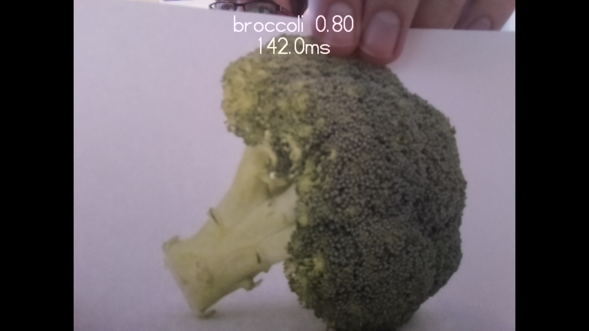

## 기계 학습 모델 테스트

여러분이 수행하게 될 첫 번째 단계는 기계 학습 모델을 사용하여 물체를 인식하는 방법을 이해하고 테스트하는 것입니다. 이 프로젝트에서는 고유한 모델을 만들고 별도의 학습을 수행하는 것이 아니라, 이미 학습된 모델을 활용해 다양한 물체를 인식할 수 있는 모델을 활용할 것입니다.

시작하기 전에 Raspberry Pi 컴퓨터를 설정하고 Raspberry Pi 카메라를 연결해야 합니다. 다음 가이드에서 두 가지를 모두 수행하는 방법에 대한 설명서를 찾을 수 있습니다.

--- task ---
다음 지침에 따라 Raspberry Pi 카메라 모듈을 Raspberry Pi에 연결합니다.

[카메라 모듈 시작하기](https://projects.raspberrypi.org/ko-KR/projects/getting-started-with-picamera){:target="_blank"}

--- /task ---

컴퓨터는 별도의 학습 능력이 없습니다. 컴퓨터가 하는 대부분의 일은 인간이 직접 프로그래밍한 것입니다. 따라서 몇 가지 명확하게 정의된 규칙이 있는 작업에는 컴퓨터가 매우 적합하지만 다른 물체를 인식하는 것과 같은 인간과 유사한 작업에는 어려움을 겪습니다.

머신 러닝을 사용하면 컴퓨터에 수천 개의 이미지를 표시할 수 있으며 각 이미지에는 레이블이 지정됩니다. 점차적으로 프로그램은 이미지 그룹의 특성을 학습한 다음 올바른 레이블을 부여할 수 있습니다.

이 프로세스로부터 나온 최종 결과를 모델이라고 합니다. 이렇게 training을 마치면 실제 세계에서 모델을 사용하여 작업을 수행할 수 있습니다. 

### 모델 테스트

--- task ---

 프로젝트를 시작하려면, [여기](http://rpf.io/p/ko-KR/robot-face-go){:target="_blank"}를 눌러 Raspberry Pi에 필요한 리소스를 다운로드 받으세요.

 --- /task ---

 --- task ---

 파일의 압축을 푼 다음 압축을 푼 디렉토리를 `/home/pi` 디렉토리로 이동합니다.

 --- /task ---

 프로젝트에 유용한 다양한 파일을 찾을 수 있지만 이 단계에서는 다음을 사용합니다.

 - `model.tflite` – 기계 학습 모델 파일
 - `labels.txt` – 모델이 인식할 수 있는 각 개체의 레이블
 - `classifer.py` – 모델을 테스트하는 Python 프로그램

--- task ---

Raspberry Pi **시작 메뉴**, **Programming Menu** 아래에 있는 **Thonny**를 엽니다.

 --- /task ---

--- task ---

`classifier.py` 프로그램을 **실행** 합니다.

Raspberry Pi에는 다음이 표시될 것입니다:
+ 카메라가 "보고 있는" 것
+ 인식된 주요 물체의 이름

 

--- /task ---

--- task ---

 카메라에 다른 물체를 제시하고 자신있게 인식 할 수 있는 것들을 **시도** 합니다.

 이 작업을 수행하는 동안 다음을 실험하십시오:
   - **배경**: 카메라는 카메라 앞에 있는 객체가 아닌 배경을 인식할 수 있습니다.
   - **물체 위치**: 물체를 잡는 위치와 방법에 따라 물체가 얼마나 잘 인식되는지에 영향을 미칠 수 있습니다. 카메라로부터 얼마나 떨어져 있는지 거리를 실험하고 물체를 다른 방향으로 돌립니다.
   - **조명**: 방의 조명은 물체를 감지하는 정도에 영향을 줄 수 있습니다. 더 많은 조명을 켜거나 일부 조명을 꺼 주세요.
   - **이미지**: 사물 자체보다 카메라가 출력한 사물의 이미지를 보여주는 것이 도움이 될 수 있습니다.

--- /task ---

--- task ---

**적어도** 카메라가 안정적으로 인식할 수 있는 4개의 객체(혹은 이미지)를 찾아 보세요. — 기계학습 모델을 위해 필요합니다.

--- /task ---

--- save ---
