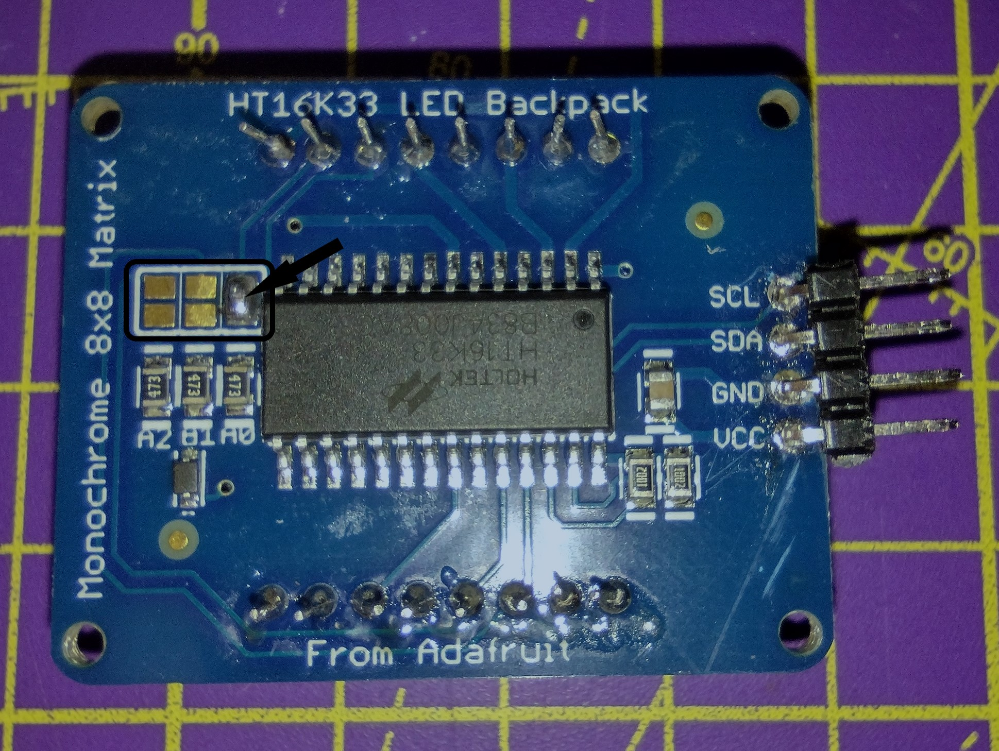

## 눈 추가하기

예제 면에 사용된 LED 매트릭스는 Raspberry Pi와 I2C로 연결됩니다. I2C를 사용하는 장치는 주소라는 특정 번호를 사용하여 연결됩니다. 두 개의 매트릭스를 사용하므로 각각 고유한 주소가 필요합니다. 

--- task ---

연결하기 전에 관련 [조립 지침](https://learn.adafruit.com/adafruit-led-backpack/0-8-8x8-matrix-assembly){:target="_blank"}을 따라야 합니다. LED 어레이의 조립에는 약간의 납땜이 필요하므로 도구를 사용하기 전에 보호자의 허가를 받으십시오. 여기에서 납땜 가이드를 확인할 수 있습니다. <iframe width="560" height="315" src="https://www.youtube.com/embed/8Z-2wPWGnqE" title="유튜브 비디오 플레이어" frameborder="0" allow="accelerometer; autoplay; clipboard-write; encrypted-media; gyroscope; picture-in-picture" allowfullscreen mark="crwd-mark"></iframe>

--- /task ---

이 프로젝트에 사용된 매트릭스는 모두 동일한 주소로 제공됩니다. 즉, 두 매트릭스가 함께 작동하려면 그 중 하나에 새 주소가 필요합니다. 이를 위해서는 더 많은 납땜이 필요합니다.

--- task ---

납땜 키트를 사용할 때, `A0` 연결을 **하나의** 매트릭스에 대해서만 유지하도록 화살표와 같이 납땜하세요.

--- /task ---

--- task ---

로봇 얼굴의 사각형 소켓에 LED 눈을 부착합니다. 고무 밴드를 사용하여 고정하고 핀이 상단에 있는지 확인하십시오.

--- /task ---

이제 로봇 얼굴의 기본 구성이 완료되었으므로 Raspberry Pi 컴퓨터를 추가하고 구성 요소를 연결해야 합니다.
