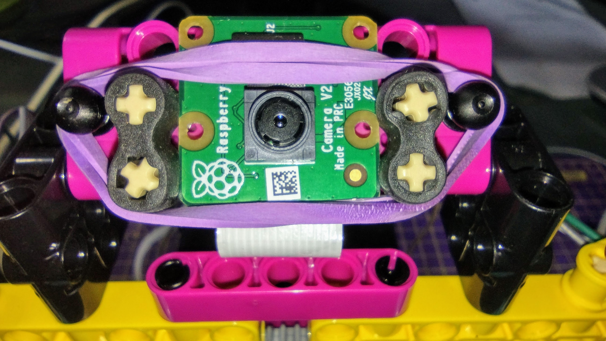

## 라즈베리파이 추가

이 프로젝트에서는 Build Plate 요소를 사용하여 Raspberry Pi 및 Build HAT를 마운트하는 것이 이상적입니다.

--- task ---

M2 볼트와 너트를 사용하여 라즈베리 파이를 빌드 플레이트에 장착하고 Pi가 평평한 면에 있는지 확인합니다.

 

--- /task ---

이런 식으로 라즈베리 파이를 장착하면 포트와 SD 카드 슬롯에 쉽게 액세스할 수 있습니다.

### 카메라 장착 및 HAT 빌드

Build HAT를 추가하기 전에 먼저 카메라 리본 케이블을 Raspberry Pi에 연결하고 Build HAT의 구멍을 통해 연결해야 합니다. 카메라 보드를 Raspberry Pi에 아직 연결하지 않은 경우 다음 지침에 따라 연결할 수 있습니다. [카메라 모듈 시작하기](https://projects.raspberrypi.org/en/projects/getting-started-with-picamera){:target="_blank"}.

--- task ---

카메라 리본을 Raspberry Pi에 연결된 상태로 두고 작은 검은색 클립을 위로 밀고 리본을 밖으로 밀어 리본의 느슨한 끝에서 카메라 보드를 제거합니다.

--- /task ---

--- task ---

Build HAT의 아래쪽과 위쪽을 통해 리본을 찔러 리본이 꼬이지 않았는지 확인합니다. 

--- /task ---

--- task ---

Build HAT를 Raspberry Pi와 정렬하여 `This way up` 레이블을 볼 수 있도록 합니다. 모든 GPIO 핀이 HAT로 덮여 있는지 확인하고 단단히 누릅니다. (이 예에서는 [스택 헤더](https://www.adafruit.com/product/2223){:target="_blank"}을 사용하므로 핀이 더 길어집니다.)

--- /task ---

--- 작업 --- 리본 케이블 끝에 카메라를 다시 부착하고 꼬이지 않았는지 확인합니다.

--- /task ---

--- 작업 --- 검은색 스터드를 사용하여 빌드 플레이트를 로봇 얼굴 뒤쪽에 연결합니다. 

이 방법으로 Raspberry Pi를 장착하면 포트와 핀에 가장 잘 액세스할 수 있으며 배럴 잭이 로봇 얼굴에 전원을 공급하기 위해 쉽게 연결됩니다.

--- /task ---

--- task ---

작은 LEGO® Technic™ 모터를 포트 A와 B에 연결하면 입을 제어할 수 있습니다.

--- /task ---

--- task ---

커다란 LEGO® Technic™ 모터를 포트 C에 연결하면 눈썹을 제어할 수 있습니다.

--- /task ---

--- task ---

하단의 접착 패드를 사용하여 대형 LEGO® 모터를 지지하는 프레임 상단에 브레드보드를 붙입니다.

--- /task ---

--- task ---

홀더 아래에 리본을 통과시키고 양쪽에 있는 고무 마개 사이에 캠라를 끼워 로봇 얼굴 상단의 홀더에 카메라 보드를 장착합니다.

양쪽에 있는 검은색 러그를 사용하여 탄성 밴드로 카메라를 고정합니다.

--- /task ---

한 쌍의 눈을 Raspberry Pi GPIO에 연결하려면 먼저 브레드보드를 사용하여 함께 연결한 다음 브레드보드의 GPIO 핀에 연결해야 합니다.

--- task ---

8개의 암수 점퍼 와이어를 사용하여 브레드보드에서 각 눈의 핀 4개를 함께 연결합니다. 두 VCC 핀이 브레드보드의 같은 행에 있는지, 두 GND 핀이 같은 행에 있는지 확인하십시오. 그런 다음 아래와 같이 Raspberry Pi의 3V3, GND, SDA 및 SCL 핀에 연결합니다.

--- /task ---

이제 로봇 얼굴이 만들어지고 연결되었으며 프로그래밍할 준비가 되었습니다!

