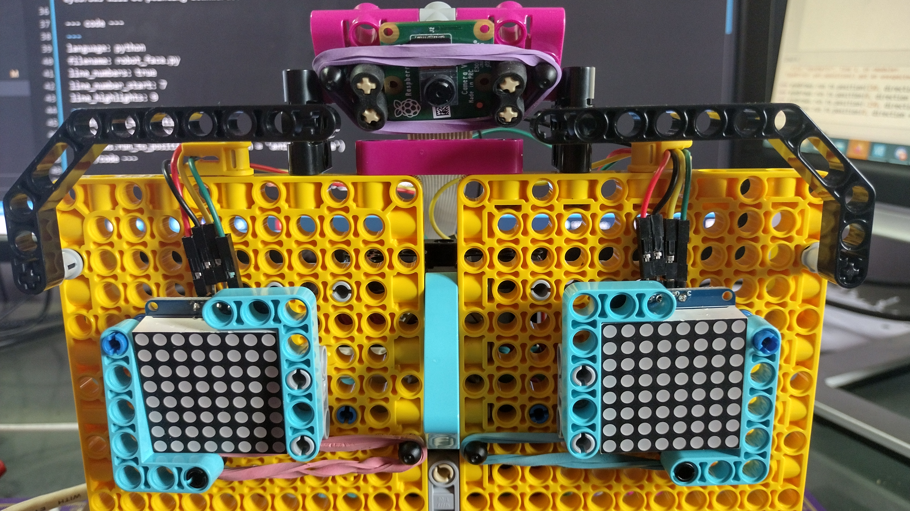

## 눈썹 프로그래밍

세 번째 모터는 얼굴의 눈썹을 움직이는 데 사용됩니다.

--- task ---

눈썹의 모터에 대한 객체를 설정합니다.

--- code ---
---
language: python 
filename: robot_face.py 
line_numbers: true 
line_number_start: 3
line_highlights: 5
---
mouth_r = Motor('A') 
mouth_l = Motor('B') 
eyebrows = Motor('C')

--- /code ---

--- /task ---

--- task ---

**롤리팝** 과 **원** 이 정렬되고 얼굴의 눈썹이 수평으로 설정되도록 배치가 잘 되었는지 확인합니다. 그렇지 않은 경우 빌드를 약간 조정해야 할 수 있습니다.

--- /task ---

--- task ---

이제 프로그램이 시작될 때 `0` 위치로 회전하도록 설정합니다.

--- code ---
---
language: python 
filename: robot_face.py 
ine_numbers: true 
line_number_start: 7
line_highlights: 9
---
mouth_r.run_to_position(0) 
mouth_l.run_to_position(0) 
eyebrows.run_to_position(0)
--- /code ---

--- /task ---

여기에 표시되는 세 가지 눈썹 위치가 있지만 더 만들 수 있습니다.

- `0` 은 눈썹을 수평으로 보이게 합니다.
- `150` 은 눈썹을 내립니다.
- `-150` 은 눈썹을 올립니다.

--- task ---

현재 눈썹 위치를 가져오는 함수를 추가하고, 이동하고자 하는 위치가 현재 위치보다 작으면 시계 반대 방향으로 이동하고, 그렇지 않으면 시계 방향으로 이동합니다.

--- code ---
---
language: python 
filename: 
line_numbers: true 
line_number_start: 17
line_highlights:
---
def move_eyebrows (position): 
    current_position = eyebrows.get_aposition() 
    if position < current_position: 
        rotation = 'anticlockwise' 
    else: 
        rotation = 'clockwise' 
    eyebrows.run_to_position(position, direction = rotation)

--- /code ---

--- /task ---

--- task ---

**Shell**에서 새 기능을 테스트합니다.

--- code ---
---
language: python 
filename: 
line_numbers: false 
line_number_start:
line_highlights:
---
>>> move_eyebrows(-150) 
>>> move_eyebrows(150) 
>>> move_eyebrows(0)
--- /code ---

--- /task ---

--- save ---
