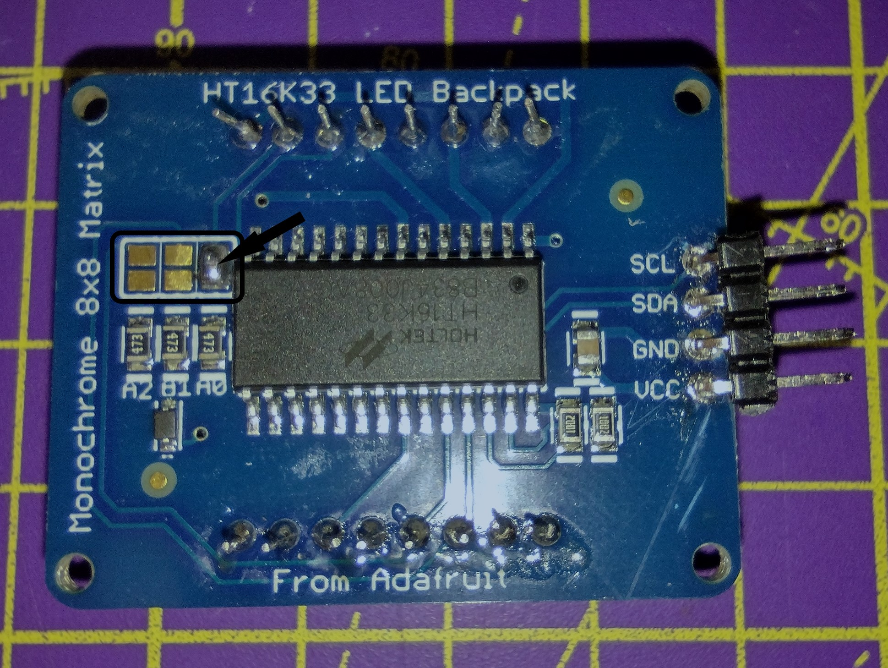

## Добавьте глаза

Светодиодные матрицы, используемые в примере лица, подключаются к Raspberry Pi I2C. Устройства, использующие I2C, подключаются с использованием определенного номера, называемого адресом. Поскольку вы используете две матрицы, каждой из них потребуется свой адрес. 

--- task ---

Перед их подключением необходимо выполнить соответствующие [инструкции по сборке](https://learn.adafruit.com/adafruit-led-backpack/0-8-8x8-matrix-assembly){: target = "_ blank"}. Сборка светодиодных матриц требует некоторой пайки, поэтому перед использованием каких-либо инструментов получите разрешение взрослого. Вы можете следовать нашему руководству по пайке здесь.

<iframe width="560" height="315" src="https://www.youtube.com/embed/8Z-2wPWGnqE" title="Видеопроигрыватель YouTube" frameborder="0" allow="accelerometer; autoplay; clipboard-write; encrypted-media; gyroscope; picture-in-picture" allowfullscreen></iframe>

--- /task ---

Все матрицы, используемые в этом проекте, имеют один и тот же адрес, а это означает, что для совместной работы двоих одному из них нужен новый адрес. Для этого потребуется еще немного пайки.

--- task ---

Используя свой набор для пайки, закройте соединение `A0` **только одной** из ваших матриц.

--- /task ---

--- task ---

Поместите глаза в квадратные гнезда на лице робота; используйте резинки, чтобы закрепить их, и убедитесь, что булавки находятся наверху.

--- /task ---

Теперь, когда базовая конструкция лица робота завершена, вам нужно добавить компьютер Raspberry Pi и подключить к нему свои компоненты.
