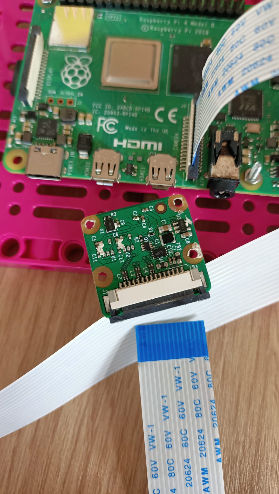
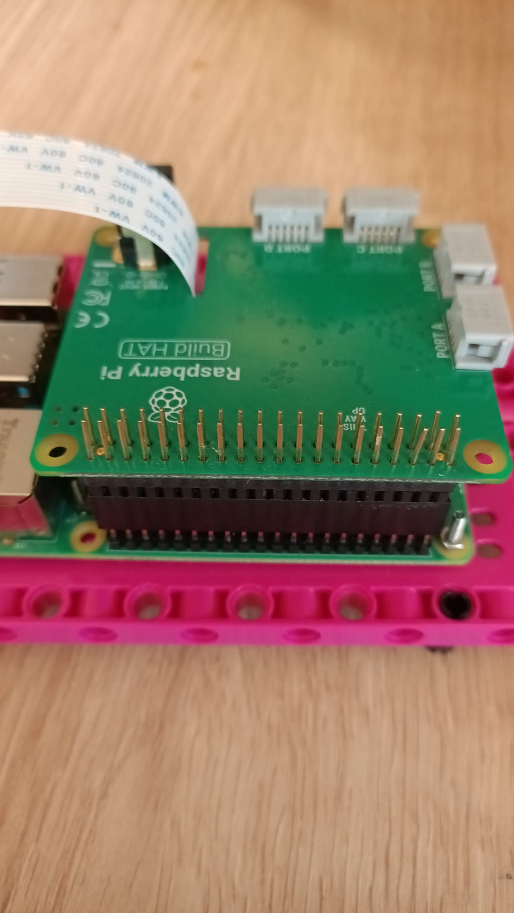
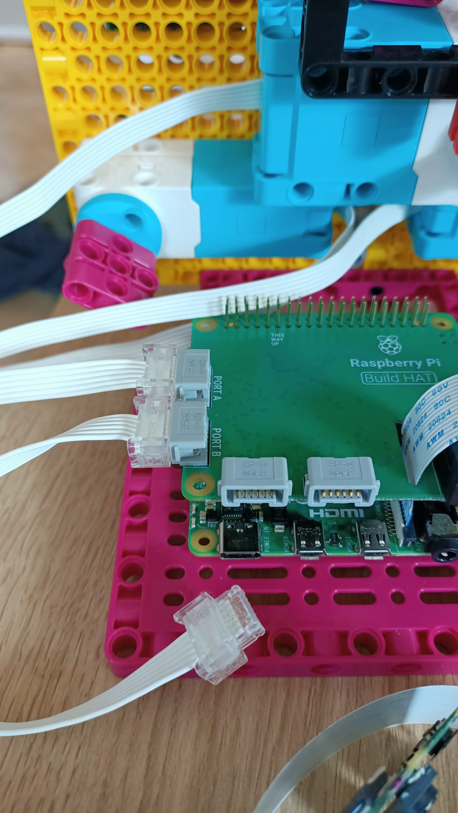

## Добавьте Raspberry Pi

Для этого проекта в идеале вы захотите использовать элемент Build Plate для установки Raspberry Pi и Build HAT:

--- task ---

Установите Raspberry Pi на монтажную пластину с помощью болтов и гаек M2, убедившись, что Pi находится на плоской стороне:

 

--- /task ---

Установка Raspberry Pi таким образом обеспечивает легкий доступ к портам, а также к слоту для SD-карты.

### Установите камеру и соберите шляпу

Перед добавлением Build HAT вам сначала нужно подключить ленточный кабель камеры к Raspberry Pi и пропустить его через отверстие в Build HAT. Если вы еще не подключили плату камеры к Raspberry Pi, вы можете сделать это, выполнив следующие инструкции: [Начало работы с модулем камеры](https://projects.raspberrypi.org/en/projects/getting-started-with-picamera){: target = "_ blank"}.

--- task ---

Оставьте ленту камеры подключенной к Raspberry Pi, но снимите плату камеры с свободного конца ленты, подтолкнув небольшой черный зажим и выдвинув ленту наружу:

--- /task ---

--- task ---

Проденьте ленту через нижнюю часть Build HAT и наружу через верх, убедившись, что лента не перекручена: 

--- /task ---

--- task ---

Совместите Build HAT с Raspberry Pi, убедившись, что вы видите метку `наверху` Убедитесь, что все контакты GPIO закрыты шляпой, и сильно надавите на нее. (В примере используется заголовок стекирования {: target = "_ blank"}, что делает выводы длиннее.)

--- /task ---

--- задача --- Снова прикрепите камеру к концу ленточного кабеля, убедившись, что он не перекручен.

--- /task ---

--- задача --- Присоедините пластину сборки к задней части лица вашего робота, используя несколько черных шпилек. 

Установка Raspberry Pi таким образом дает лучший доступ к портам и контактам, а также означает, что ваше цилиндрическое гнездо легко подключается для питания лица робота.

--- /task ---

--- task ---

Подключите свои маленькие моторы LEGO® Technic ™ к портам A и B, чтобы управлять ртом.

--- /task ---

--- task ---

Подключите свой большой мотор LEGO® Technic ™ к порту C, чтобы контролировать брови.

--- /task ---

--- task ---

Используя липкую подушку внизу, приклейте макет к верхней части рамы, на которой установлен большой мотор LEGO®.

--- /task ---

--- task ---

Установите плату камеры в держатель в верхней части лица робота, пропустив ленту под держателем и заклинив камеру между резиновыми стопорами с обеих сторон.

Закрепите камеру резинкой, используя черные выступы с обеих сторон.

--- /task ---

Чтобы подключить пару глаз к Raspberry Pi GPIO, их сначала нужно соединить вместе с помощью макета, а затем к контактам GPIO от макета.

--- task ---

Используйте восемь перемычек «папа-мама», чтобы соединить вместе четыре контакта от каждого проушины на макетной плате. Убедитесь, что оба вывода VCC находятся в одном ряду на макетной плате, оба вывода GND находятся в одном ряду и так далее. Затем подключитесь к контактам 3V3, GND, SDA и SCL на Raspberry Pi, как показано ниже.

--- /task ---

Теперь ваше лицо робота построено, подключено и готово к программированию!

