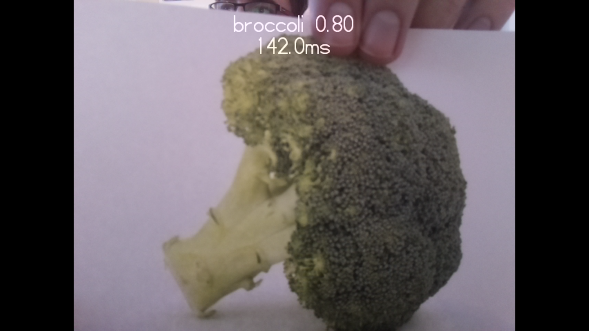

## 测试机器学习模型

您首先要了解和测试如何使用机器学习模型来识别对象。 在这个项目里，您将不需要创建和训练自己的模型，而是使用可以识别一系列对象的示例模型。

在开始之前，您需要设置 Raspberry Pi 计算机并连接 Raspberry Pi 相机。 您可以在以下指南中找到有关如何执行这两项操作的说明：

--- task --- 按照以下说明将 Raspberry Pi 相机模块连接到您的 Raspberry Pi：

[开始使用相机模块](https://projects.raspberrypi.org/en/projects/getting-started-with-picamera){:target="_blank"}

--- /task ---

计算机没有天生的学习能力。 计算机所做的大多数事情都是 由人类直接编程的。 这使它们非常适合一些具有明确定义的规则的任务，但它们在处理更人工的任务（例如识别不同的对象）时，会遇到困难。

使用机器学习，可以向计算机展示成千上万张标记过的图像。 渐渐地，机器学习程序就可以琢磨出一组图像的特征，然后给它们正确的标签。

此学习过程的最终结果称为 模型。 经过训练的模型可以在现实世界中执行任务。 

### 测试模型

--- task ---

 首先，单击[此处](http://rpf.io/p/en/robot-face-go){:target="_blank"} 将本项目的资源下载到您的 Raspberry Pi

 --- /task ---

 --- task ---

 解压文件，然后将解压的目录移动到您的 `/home/pi` 目录。

 --- /task ---

 您会发现一系列对本项目有用的文件，但目前您将使用的是：

 - `model.tflite` – 机器学习模型文件
 - `labels.txt` – 模型可以识别的对象的标签
 - `classifer.py` – 一个用于测试模型的 Python 程序

--- task ---

从 Raspberry Pi 的**开始菜单**中选择**编程菜单** ，然后选择并打开 **Thonny**。

 --- /task ---

--- task ---

打开并 **运行** `classifier.py` 程序。

您的 Raspberry Pi 将显示：
+ 相机“看到”了什么
+ 在其视野中识别出的主要对象的名称

 

--- /task ---

--- task ---

 **尝试** 向相机展示不同的物体并观察它可以自信地识别出哪些物体。

 与此同时，请尝试以下情景：
   - **背景**: 相机可能会识别（其它）物体而不是您在相机前拿着的物体。
   - **物体的位置**：物体的位置和手持方式可能会影响它被机器识别的程度。 尝试调节物体与相机的距离，并多方位旋转物体（观察对模型识别结果的影响）。
   - **照明**：房间内的照明可能会影响模型对物体的识别。 尝试打开或关闭一些灯（并观察对模型识别结果的影响）。
   - **物件图像**：您可能会发现给相机提供物体的打印图像而不是物体本身更有助于相机识别该物体。

--- /task ---

--- task ---

找到 **至少** 4个您的相机可以可靠识别的对象（或图像）——您的机器学习模型将需要它们。

--- /task ---

--- save ---
