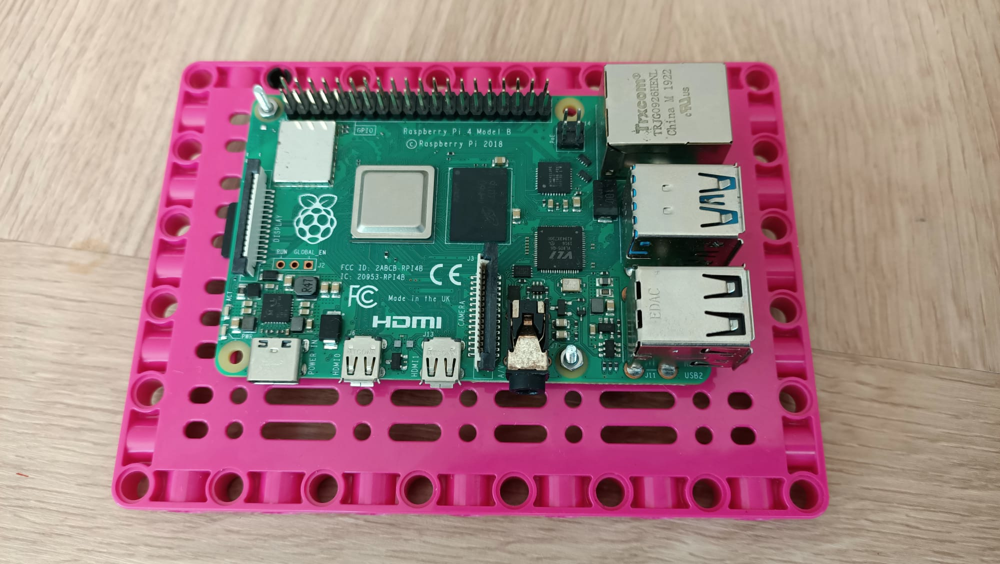
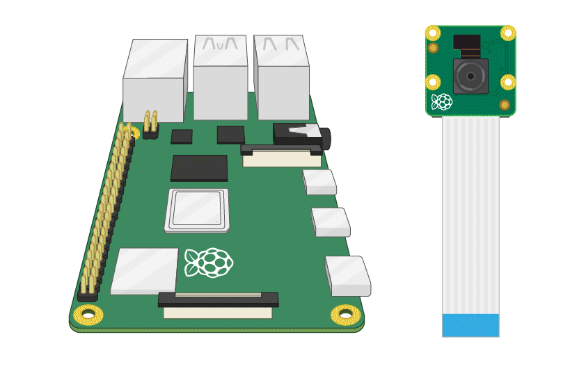
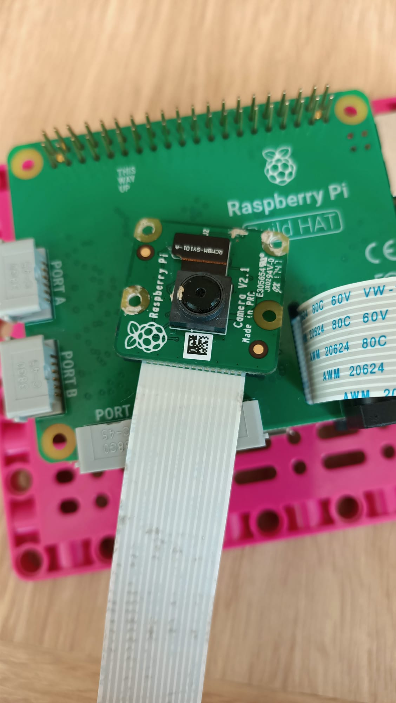
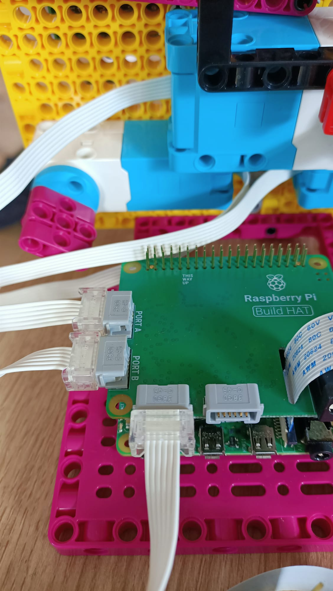
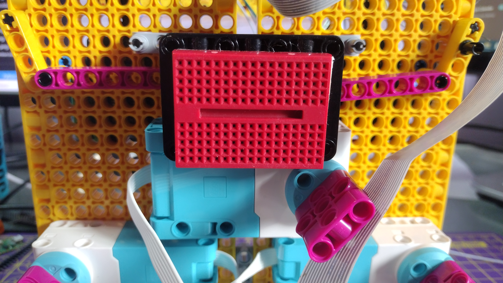

## 安装Raspberry Pi

For this project you'll ideally want to use the Maker Plate element to mount your Raspberry Pi and Build HAT:

--- task ---

Mount your Raspberry Pi onto the Maker Plate using M2 bolts and nuts, making sure the Pi is on the flat side:

 

--- /task ---

以这种方式安装 Raspberry Pi ，可以轻松访问（Raspberry Pi的）端口和 SD 卡插槽。

### 安装相机和Build HAT

在添加 Build HAT 之前，您首先需要将相机模块的带状电缆通过Build HAT的穿孔来连接到 Raspberry Pi。 如果您尚未将相机板连接到 Raspberry Pi，您可以按照以下说明连接： [相机模块入门](https://projects.raspberrypi.org/en/projects/getting-started-with-picamera) {:target="_blank"}。

--- task ---

保持相机模块的带状电缆与Raspberry Pi端的连接，在带状电缆的松散端，向上推黑色小夹子即可将带状电缆滑出，从而取下相机板：

--- /task ---

--- task ---

将带状电缆从 Build HAT底部穿入并直接穿过顶部，注意确保电缆没有扭曲：

--- /task ---

--- task ---

将 Build HAT 与 Raspberry Pi 对齐，请确保您可以看到 `This way up` 标签。 确保所有 GPIO 引脚都被Build HAT 覆盖，然后用力按下。 （该示例使用了 [堆叠头](https://www.adafruit.com/product/2223){:target="_blank"}，所以有更长的引脚。）

--- /task ---

--- task --- 将相机模块重新连接到带状电缆的末端，确保它没有扭曲。

--- /task ---

--- task --- Connect the Maker Plate to the back of your robot face using some black studs. 

以这种方式安装 Raspberry Pi 可以最好地访问（Raspberry Pi的）端口和引脚，这意味着您的桶形插孔可以轻松连接到机器人脸并为其供电。

--- /task ---

--- task ---

将您的小号乐高（LEGO®） Technic™ 马达连接到端口 A 和 B，用以控制（机器人脸的）嘴巴。

--- /task ---

--- task ---

将大号乐高（LEGO®）Technic™ 马达连接到端口 C，用于控制（机器人脸的）眉毛。

--- /task ---

--- task ---

利用面包板底部的粘合垫，将面包板粘在支撑大号 乐高（LEGO®）马达的框架顶部。

--- /task ---

--- task ---

将带状电缆从机器人脸顶部的支架下方穿过并将摄像头楔入两侧的橡胶塞之间，这样就可以将相机板安装在机器人脸顶部的支架中。

用松紧带将相机固定在两侧的黑色凸耳上。

--- /task ---

要将这对眼睛连接到 Raspberry Pi的GPIO，需要首先使用面包板将两个眼睛连接在一起，然后从面包板连接到 Raspberry Pi的GPIO 引脚。

--- task ---

使用八根公母跳线将每只眼睛的四个引脚连接到面包板上。 确保两个眼睛的 VCC 引脚都在面包板的同一行中，GND 引脚都在同一行中，依此类推。 然后连接到电源（3V3），地和Raspberry Pi上的SDA 和 SCL 引脚，如下图所示。

--- /task ---

您的机器人脸已经构建完毕、连接妥当并可以进行编程了！

