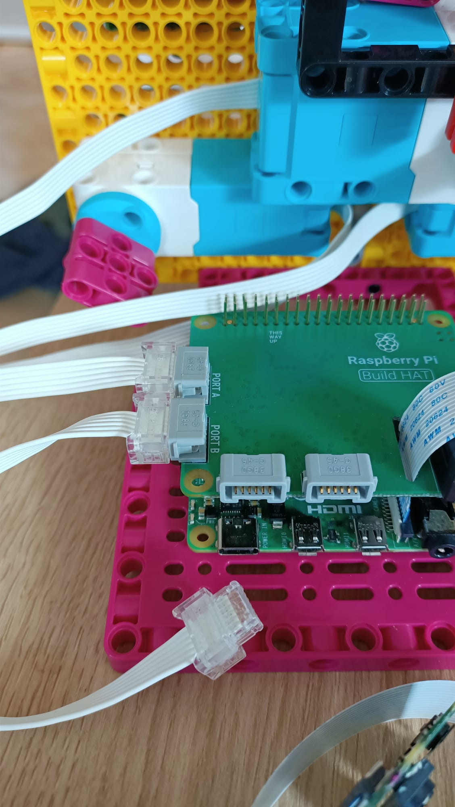

## 添加树莓派

对于这个项目，您最好使用 Build Plate 元素来安装 Raspberry Pi 和 Build HAT：

--- task ---

使用 M2 螺栓和螺母将 Raspberry Pi 安装到构建板上，确保 Pi 位于平坦的一侧：

 

--- /task ---

以这种方式安装 Raspberry Pi 可以轻松访问端口和 SD 卡插槽。

### 安装相机并构建 HAT

在添加 Build HAT 之前，您首先需要将相机带状电缆连接到 Raspberry Pi 并将其穿过 Build HAT 中的孔。 如果您尚未将相机板连接到 Raspberry Pi，您可以按照以下说明进行连接： [相机模块](https://projects.raspberrypi.org/en/projects/getting-started-with-picamera)入门 {:target="_blank"}。

--- task ---

将相机色带连接到 Raspberry Pi，但通过向上推黑色小夹子并将色带滑出，从色带松散端取下相机板：

--- /task ---

--- task ---

将色带穿过 Build HAT 的底部并穿过顶部，确保色带没有扭曲： 

--- /task ---

--- task ---

将 Build HAT 与 Raspberry Pi 对齐，确保您可以看到 `This way up` 标签。 确保所有 GPIO 引脚都被 HAT 覆盖，然后用力按下。 （该示例使用 [堆叠头](https://www.adafruit.com/product/2223){:target="_blank"}，这使得引脚更长。）

--- /task ---

--- 任务 --- 将相机重新连接到带状电缆的末端，确保它没有扭曲。

--- /task ---

--- 任务 --- 使用一些黑色螺栓将构建板连接到机器人面部的背面。 

以这种方式安装 Raspberry Pi 可以最好地访问端口和引脚，这意味着您的桶形插孔可以轻松连接到为机器人面部供电。

--- /task ---

--- task ---

将您的小型 LEGO® Technic™ 电机连接到端口 A 和 B，准备控制嘴巴。

--- /task ---

--- task ---

将大型 LEGO® Technic™ 电机连接到端口 C，准备控制眉毛。

--- /task ---

--- task ---

使用底部的粘合垫，将面包板粘在支撑大型 LEGO® 电机的框架顶部。

--- /task ---

--- task ---

通过将色带穿过支架下方并将摄像头楔入两侧的橡胶塞之间，将相机板安装在机器人面部顶部的支架中。

使用两侧的黑色凸耳用松紧带固定相机。

--- /task ---

要将这对眼睛连接到 Raspberry Pi GPIO，首先需要使用面包板将它们连接在一起，然后从面包板连接到 GPIO 引脚。

--- task ---

使用八根公母跳线将面包板上每只眼睛的四个引脚连接在一起。 确保两个 VCC 引脚都在面包板的同一行中，两个 GND 引脚都在同一行中，依此类推。 然后连接到树莓派上的 3V3、GND、SDA 和 SCL 引脚，如下图所示。

--- /task ---

您的机器人面部现已构建、连接并准备好进行编程！

