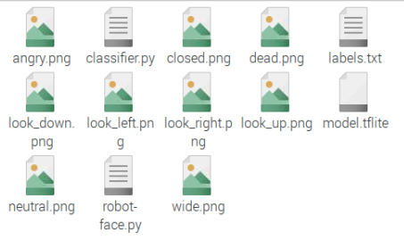

## 控制嘴巴的移动

--- task ---

从编程菜单中打开**Thonny**，新建一个文件，命名为`robots_face.py`，并将其保存在存有 `classifier.py`、 `labels.txt`和 8×8 像素图片的目录中。

--- /task ---

--- task ---

首先添加控制乐高（LEGO®）Technic™ 马达所需的导入指令。

--- code ---
---
language: python 
filename: robot_face.py 
line_numbers: true 
line_number_start:
line_highlights:
---
from buildhat import Motor 
--- /code ---

--- /task ---

--- task ---

为左右两个马达分别创建一个新对象。 在此示例中，右侧马达连接到端口 A，左侧马达连接到端口 B。

--- code ---
---
language: python 
filename: robot_face.py 
line_numbers: true 
line_number_start:
line_highlights: 3,4
---
from buildhat import Motor

mouth_r = Motor('A') 
mouth_l = Motor('B') 
--- /code ---

--- /task ---

--- task ---

当程序启动时，两个马达的指针都应停在 `0`

--- code ---
---
language: python 
filename: robot_face.py 
line_numbers: true 
line_number_start: 5
line_highlights:
---

mouth_r.run_to_position(0) 
mouth_l.run_to_position(0) 
--- /code ---

--- /task ---

--- task ---

创建一个函数用于控制嘴部的马达。 它们需要以相反的方向转动，因此左侧马达将向负值转，而右侧马达将向正值转。 添加指令 `blocking=False` 使两个马达同时转动。

--- code ---
---
language: python 
filename: robot_face.py 
line_numbers: true 
line_number_start: 8
line_highlights:
---
def move_mouth (position, speed=100): 
    mouth_l.run_to_position(position * -1, speed, blocking=False) #转向负值 
    mouth_r.run_to_position(position, speed, blocking=False) #转向正值 
--- /code ---

--- /task ---

--- task ---

在 **Shell**窗口中运行您的程序，测试新函数。

--- code ---
---
language：python 
filename： 
line_numbers：false 
line_number_start:
line_highlights:
---
>>> move_mouth(45) 
>>> move mouth(0) 
--- /code ---

如果您的马达朝错误的方向移动，可以尝试互换它们的端口。

--- /task ---

--- save ---
