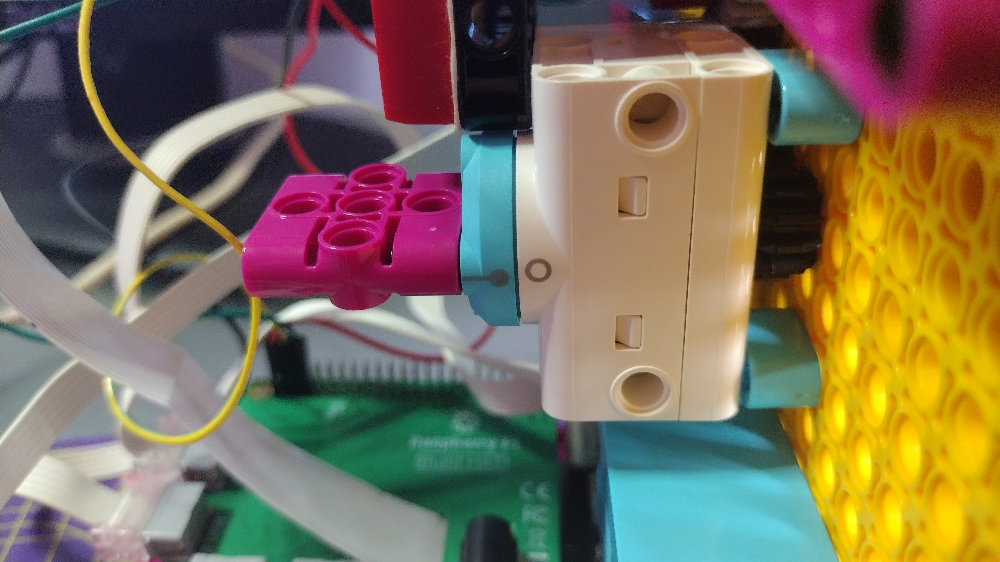

## 眉毛的编程

第三个马达用于控制人脸上眉毛的移动。

--- task ---

为眉毛的马达设置一个对象。

--- code ---
---
language: python filename: robot_face.py line_numbers: true line_number_start: 3
line_highlights: 5
---
mouth_r = Motor('A') mouth_l = Motor('B') eyebrows = Motor('C')

--- /code ---

--- /task ---

--- task ---

确保您的大号马达的 **棒棒糖** 和 **圆圈** 对齐，并且人脸的眉毛处于水平位置。 如果不是这样，您可能需要稍微调整您的设计。

--- /task ---

--- task ---

在程序启动时，将马达调整为 `0`。

--- code ---
---
language: python filename: robot_face.py line_numbers: true line_number_start: 7
line_highlights: 9
---
mouth_r.run_to_position(0) mouth_l.run_to_position(0) eyebrows.run_to_position(0) --- /code ---

--- /task ---

此处将显示眉毛三个的位置，但您可以创建更多位置。

- `0` 会使眉毛处于水平位置
- `150` 将降低眉毛
- `-150` 会升高眉毛的位置（挑眉）

--- task ---

添加一个函数用于获取当前眉毛位置，如果眉毛应该移动到的位置小于当前位置，则逆时针移动马达，否则顺时针移动马达。

--- code ---
---
language: python filename: line_numbers: true line_number_start: 17
line_highlights:
---
def move_eyebrows (position): current_position = eyebrows.get_aposition() if position < current_position: rotation = 'anticlockwise' else: rotation = 'clockwise' eyebrows.run_to_position(position, direction = rotation)

--- /code ---

--- /task ---

--- task ---

在 **Shell**窗口中运行您的代码，测试该函数。

--- code ---
---
language: python filename: line_numbers: false line_number_start:
line_highlights:
---
> > > move_eyebrows(-150) move_eyebrows(150) move_eyebrows(0) --- /code ---

--- /task ---

--- save ---
